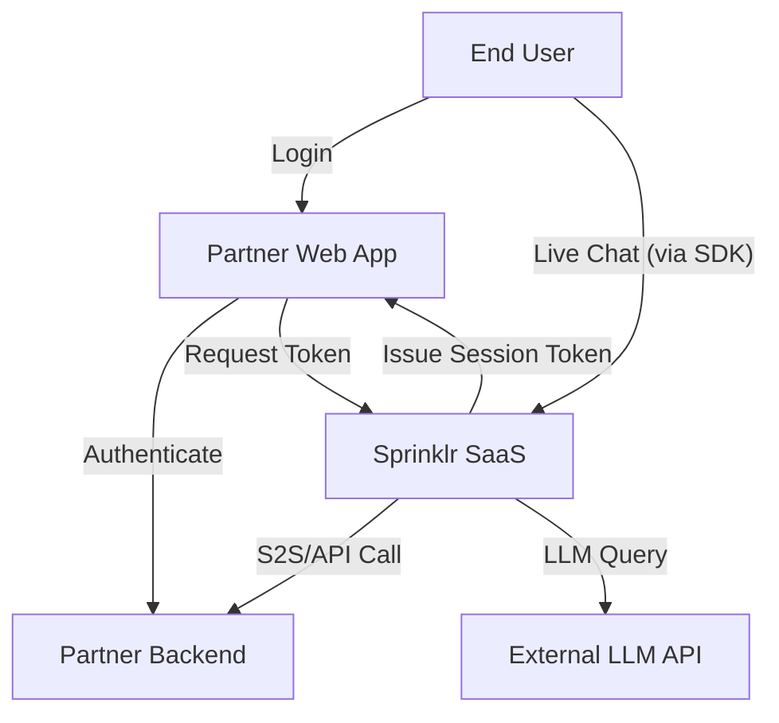

# Data Flows

This section describes the key data flows within the Sprinklr Live Chat platform, illustrating how information moves between actors and system components.

## High-Level Data Flow

1. **End User Login:**  
   The end user logs into the partner web or mobile app.

2. **Authentication:**  
   The partner app authenticates the user and requests a session token from Sprinklr SaaS.

3. **Live Chat Initiation:**  
   The end user initiates a chat session via the embedded Sprinklr SDK.

4. **Session Establishment:**  
   The partner app presents the session token to Sprinklr SaaS, which validates and establishes a secure WebSocket channel.

5. **Message Exchange:**  
   Messages are exchanged in real time between the end user and Sprinklr SaaS, with optional context or data fetched from the partner backend.

6. **LLM Integration:**  
   Sprinklr SaaS may call external LLM APIs to generate contextual responses, using knowledge from the partner backend or uploaded FAQs.

## Detailed Data Flow Diagram

## Security Considerations

- All data flows crossing trust boundaries are protected with TLS (for browser to service) and mTLS (for service to service).
- Authentication and authorization are enforced at every step.
- Sensitive data is encrypted in transit and at rest.
- For communication between the end user and the Sprinklr Live Chat Service, session tokens are generated via a partner system. These tokens establish a secure authentication and authorization (authn/authz) channel.  
-  A short-lived token is issued per session, with a brief TTL, and is refreshed periodically to maintain security without long-lived credentials.
