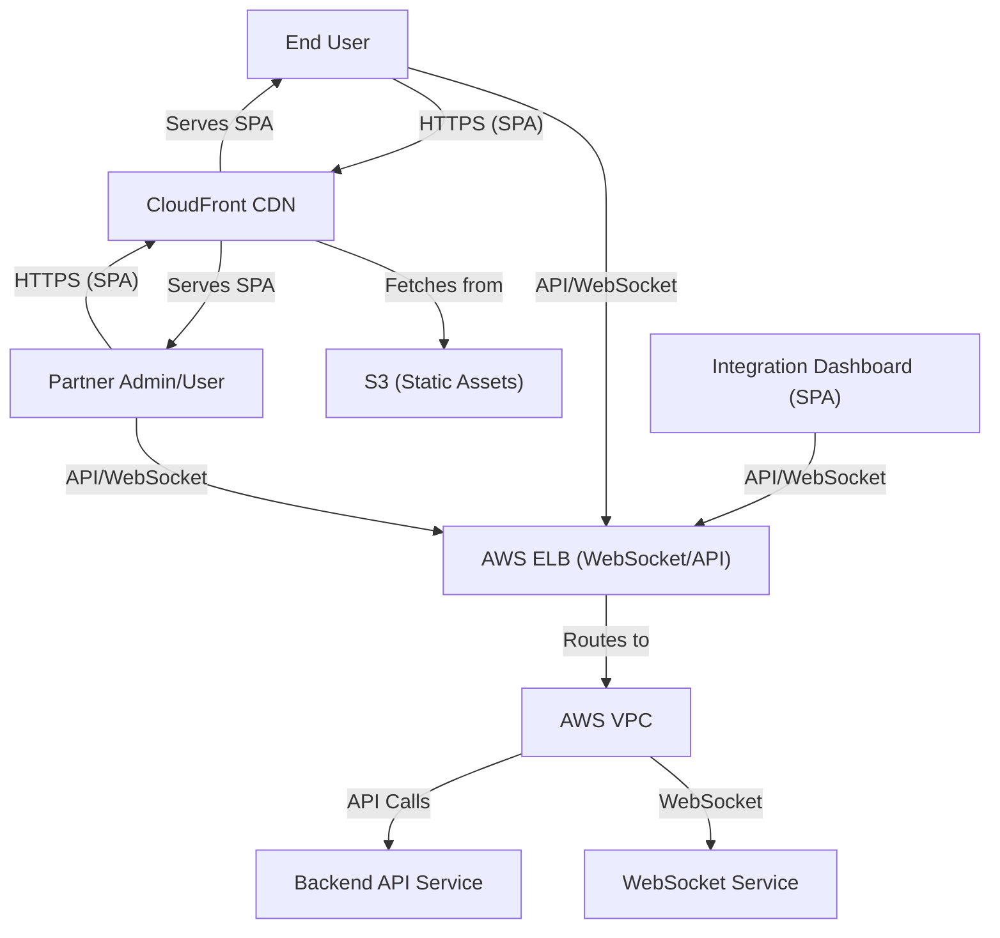
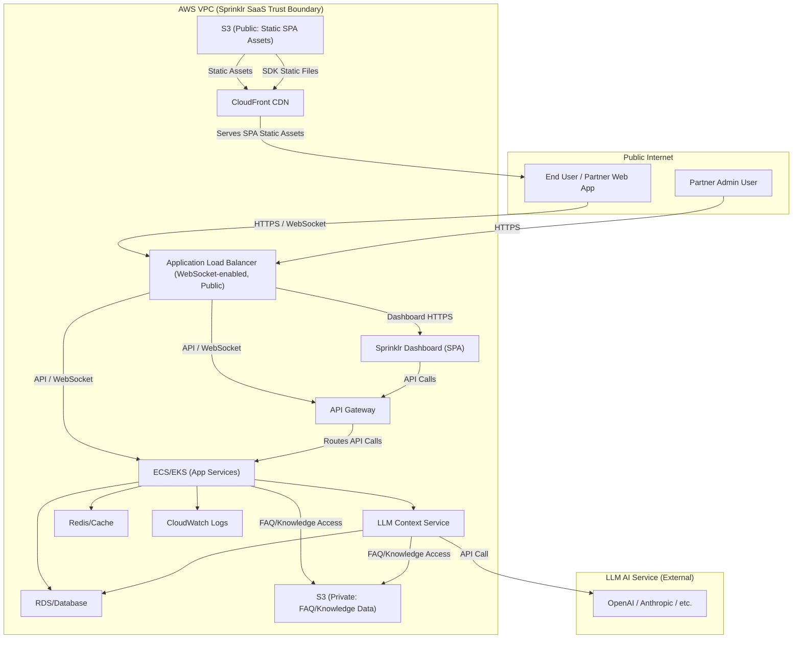

# Sprinklr SaaS Cloud Architecture & Data Flows

This section details the internal cloud architecture of the Sprinklr SaaS platform as deployed on AWS, and the major data flows between its components. The architecture is designed for security, scalability, and operational excellence, with clear trust boundaries and secure delivery paths for all assets and APIs.

## High-Level Minimal Architecture Diagram

The following minimal diagram highlights the main actors and core AWS components involved in the integration, focusing on the Sprinklr Integration Dashboard (SPA), AWS VPC, Backend API Service, WebSocket, AWS ELB, S3, CloudFront, and connections from end users and partner users/admins. CloudFront is shown as the entry point for static assets, in front of the Sprinklr VPC.

## High-Level AWS System Architecture

The following diagram shows the main AWS infrastructure components used by Sprinklr SaaS, including load balancers, API gateways, compute clusters, storage, caching, logging, and the use of S3 and CloudFront for secure SDK delivery. WebSocket connections for live chat are supported via the Application Load Balancer (ALB) and routed to the ECS/EKS app services.

## Component Breakdown

- **Application Load Balancer (ALB):**  
  Entry point for all HTTPS and WebSocket traffic. Routes requests to API Gateway or directly to ECS/EKS services. Supports WebSocket connections for real-time chat.

- **API Gateway (AGW):**  
  Central API entry point, enforcing authentication, rate limiting, and routing to backend services.

- **ECS/EKS (App Services):**  
  Containerized application services for chat orchestration, session management, and business logic. Scales automatically based on demand.

- **LLM Context Service:**  
  Handles context enrichment and queries to external LLM APIs (e.g., OpenAI, Anthropic). Accesses private S3 for knowledge data.

- **RDS/Database:**  
  Stores persistent chat data, user sessions, and configuration.

- **S3 (Public):**  
  Hosts static assets (SPA, SDK) delivered via CloudFront CDN.

- **S3 (Private):**  
  Stores sensitive knowledge data, FAQs, and partner-uploaded content.

- **Redis/Cache:**  
  Provides low-latency caching for session and frequently accessed data.

- **CloudWatch Logs:**  
  Centralized logging for monitoring, alerting, and incident response.

- **CloudFront CDN:**  
  Delivers static assets globally with low latency and DDoS protection.

- **Sprinklr Dashboard (SPA):**  
  Admin and analytics dashboard, served as a static SPA.

## Security Controls

- **Network Segmentation:**  
  All critical services are deployed within a private VPC. Only ALB/ELB and CloudFront are exposed to the public internet.

- **mTLS Everywhere:**  
  Mutual TLS is enforced for all partner-to-cloud and internal service-to-service communication.

- **Authentication & Authorization:**  
  API Gateway enforces strict authentication and role-based access control for all API requests.

- **Secrets Management:**  
  All credentials, API keys, and certificates are managed via AWS Secrets Manager or Vault.

- **Monitoring & Logging:**  
  CloudWatch and GuardDuty provide real-time monitoring, alerting, and threat detection.

- **DDoS Protection:**  
  CloudFront and ALB provide built-in DDoS mitigation.

## Operational Practices

- **Auto-Scaling:**  
  ECS/EKS and other services scale automatically based on load.

- **Disaster Recovery:**  
  Regular backups, cross-region replication, and tested recovery procedures.

- **Continuous Deployment:**  
  Infrastructure as Code (IaC) and CI/CD pipelines ensure consistent, auditable deployments.

## Summary

The Sprinklr SaaS cloud architecture leverages AWS best practices for security, scalability, and operational excellence. All public access is tightly controlled, and sensitive data is protected at every layer. This architecture supports secure, high-performance live chat for global partners and end users.
