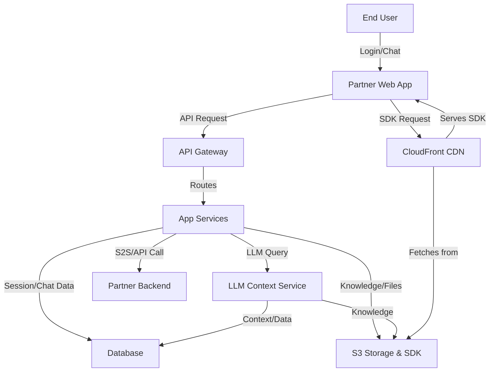

# Data Flow Diagram (DFD)

This section illustrates the flow of data between the main actors and services in the Sprinklr SaaS platform, including user authentication, chat session management, LLM context queries, S2S/API calls, and the secure delivery of the SDK via CloudFront and S3. It highlights the key integration points and the movement of sensitive data across trust boundaries.

## Key Points

- Sensitive data is protected at all stages with encryption in transit and at rest.
- All API and chat flows are authenticated and authorized.
- The SDK is delivered securely via CloudFront and S3, ensuring integrity and availability.
