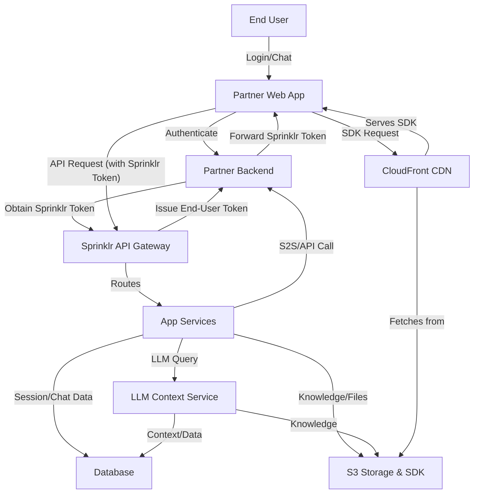

# Data Flow Diagram (DFD)

This section illustrates the flow of data between the main actors and services in the Sprinklr SaaS platform, including user authentication, chat session management, LLM context queries, S2S/API calls, and the secure delivery of the SDK via CloudFront and S3. It highlights the key integration points and the movement of sensitive data across trust boundaries.

## Key Points

- Sensitive data is protected at all stages with encryption in transit and at rest.
- All API and chat flows are authenticated and authorized.
- The SDK is delivered securely via CloudFront and S3, ensuring integrity and availability.

---

## Detailed Data Flow Sections

### 1. User Authentication Flow

#### Actors: 
  - End User
  - Partner Web App
  - Partner Backend
  - Sprinklr API Gateway
  - App Services
  - Database

#### Steps
  1. End User authenticates with the Partner Web App (PWA) using the partner's identity provider.
  2. The PWA, upon successful authentication, securely communicates with the Partner Backend (PB) to request access to Sprinklr services.
  3. The Partner Backend authenticates the user/session and then initiates a secure request to the Sprinklr API Gateway (AGW) to obtain a Sprinklr end-user token on behalf of the user.
  4. The Sprinklr API Gateway validates the request (e.g., using OAuth2 client credentials, signed JWT, or SSO assertion) and issues a Sprinklr end-user token (JWT or similar) to the Partner Backend.
  5. The Partner Backend forwards the Sprinklr token to the PWA.
  6. The PWA stores the Sprinklr token securely (in memory or secure storage) and uses it for all subsequent API requests to Sprinklr services.
  7. All tokens and credentials are encrypted in transit (TLS) and at rest (DB encryption).
  8. Trust boundaries: End User ↔️ PWA, PWA ↔️ PB, PB ↔️ AGW, AGW ↔️ ECS.

#### Security Controls:
  - TLS for all communications.
  - Strong authentication and authorization between PWA and PB, and PB and AGW (OAuth2, SSO, signed JWT).
  - Sprinklr session tokens signed and validated.
  - PWA never exposes Sprinklr credentials to the end user.
  - Rate limiting and monitoring at AGW and PB.

---

### 2. Chat Session Management Flow

**Actors:** End User, Partner Web App, API Gateway, App Services, Database

**Steps:**
1. Authenticated End User starts or resumes a chat session via PWA.
2. PWA sends chat requests (initiate, send message, fetch history) to AGW.
3. AGW routes requests to ECS, which manages chat state and persists messages in RDS.
4. ECS enforces access control, ensuring users can only access their own sessions.
5. All chat data is encrypted in transit and at rest.

**Security Controls:**
- Authenticated API access.
- Access control checks in ECS.
- Audit logging of chat actions.
- Data encryption (TLS, DB encryption).

---

### 3. LLM Context Query Flow

**Actors:** App Services, LLM Context Service, Database, S3 Storage

**Steps:**
1. ECS formulates a context query for the LLM Context Service (LLM).
2. Query and any required data are sent over secure internal channels.
3. LLM may fetch additional context from RDS or S3 (knowledge base, files).
4. LLM returns results to ECS, which may update RDS or S3 as needed.

**Security Controls:**
- Internal service-to-service authentication (mTLS, IAM roles).
- Data minimization: only required context is shared.
- Logging and monitoring of LLM queries.
- Encryption in transit and at rest.

---

### 4. S2S/API Call Flow

**Actors:** App Services, Partner Backend

**Steps:**
1. ECS initiates a server-to-server (S2S) API call to the Partner Backend (PB) for integration (e.g., fetching user data).
2. Calls are authenticated using API keys, OAuth, or signed requests.
3. Sensitive data exchanged is encrypted in transit.

**Security Controls:**
- Mutual authentication (API keys, OAuth, mTLS).
- Least privilege access (scoped tokens).
- Monitoring and alerting on S2S/API activity.

---

### 5. Secure SDK Delivery Flow

**Actors:** Partner Web App, CloudFront CDN, S3 Storage

**Steps:**
1. PWA requests the SDK from CloudFront (CF).
2. CF serves the SDK, fetching from S3 if needed.
3. SDK is delivered over HTTPS, ensuring integrity and confidentiality.

**Security Controls:**
- SDK integrity checks (hash/signature validation).
- HTTPS enforced for all SDK delivery.
- S3 bucket access restricted to CF.
- Monitoring for unauthorized access attempts.

---

### Sensitive Data Types

- User credentials and tokens
- Chat messages and session data
- LLM context and knowledge base files
- API keys and integration secrets
- SDK binaries

All sensitive data is protected with encryption, access controls, and monitoring.
