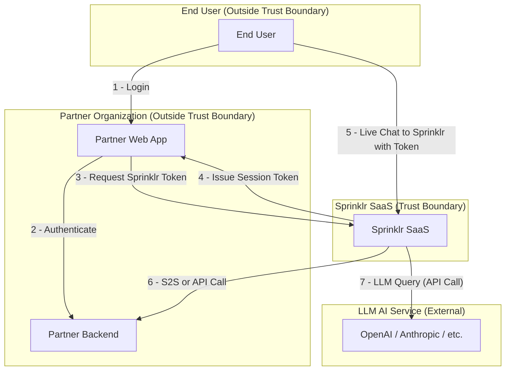

# Overview:

This section provides a top-level overview of the main trust boundaries and data flows in the Sprinklr Live Chat system. It illustrates how the End User interacts with the Client Web App, how authentication and session tokens are managed, and how the Client Web App and End User communicate with the Sprinklr SaaS platform for live chat functionality. The diagram highlights the separation between client and Sprinklr trust boundaries and the key steps in the authentication and chat flow.

