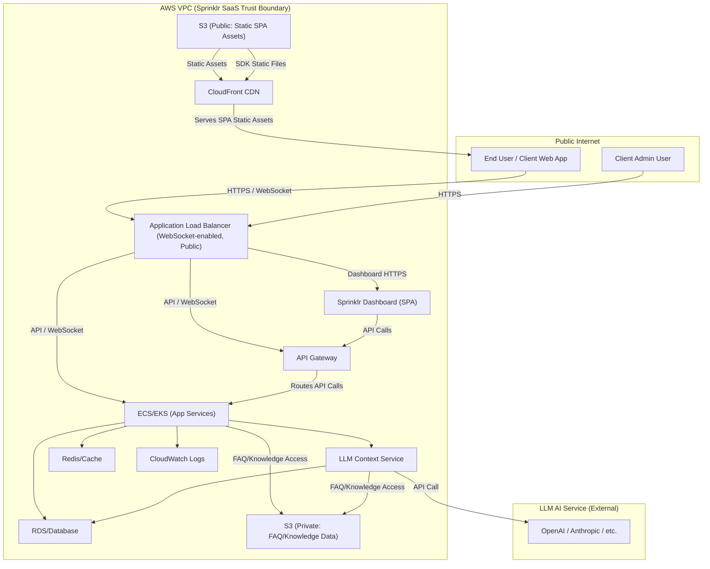

# Threat Model: Cloud System Design (Sprinklr Live Chat)

## Scope

This document presents the threat model for the cloud infrastructure supporting Sprinklr Live Chat. It focuses on the AWS-based architecture, network boundaries, storage, APIs, and cloud-native services, identifying key threats and mitigations specific to the cloud environment. Application-level threats are covered in a separate document.

---

## Cloud Trust Boundaries

- **Public Internet → AWS VPC:** Entry point for all user and partner traffic; exposed via Elastic Load Balancers (ELB), API Gateways, and CloudFront. The same gateway is used for public access by end users, partner services (S2S/API), and partner admins accessing the Sprinklr integration dashboard.
- **Partner Organization → Sprinklr SaaS Cloud:** S2S/API calls from partner backends to Sprinklr cloud endpoints, secured with mutual TLS (mTLS) authentication to ensure only authorized partners can communicate with Sprinklr Cloud backend.
- **Sprinklr SaaS Internal Segmentation:** Isolation between microservices, databases, storage, and LLM context services within the VPC.
- **Sprinklr SaaS → External LLM APIs:** Outbound calls to third-party LLM providers (e.g., OpenAI, Anthropic).
- **Admin Access → Cloud Management Plane:** Access by Sprinklr engineers to AWS console, infrastructure as code, and CI/CD pipelines.
- **Multi-Region Deployment:** Sprinklr Live Chat is deployed across multiple AWS regions to ensure high availability, performance, and system uptime for all tenants.

___

## High-level Design

---

## STRIDE Threat Mapping: Cloud Components

| Cloud Component                | S | T | R | I | D | E | Key Mitigations |
|-------------------------------|---|---|---|---|---|---|-----------------|
| Application Load Balancer      | ✔ | ✔ |   | ✔ | ✔ |   | TLS, WAF, DDoS protection, strict routing, logging, multi-region, auto-scaling |
| API Gateway                   | ✔ | ✔ | ✔ | ✔ | ✔ | ✔ | AuthN/Z, input validation, rate limiting, audit logs, single entry point for all public/partner/admin access | Logical seperation of services via RBAC 
| ECS/EKS (App Services)         | ✔ | ✔ | ✔ | ✔ | ✔ | ✔ | Network segmentation, IAM roles, container hardening, logging, multi-tenancy isolation |
| RDS/Database                   | ✔ | ✔ |   | ✔ | ✔ | ✔ | Encryption at rest, VPC-only access, IAM, audit logs |
| S3 (Public/Private)            | ✔ | ✔ |   | ✔ | ✔ |   | Bucket policies, encryption, S3 Block Public Access, versioning |
| CloudFront CDN                 | ✔ | ✔ |   | ✔ | ✔ |   | Signed URLs, HTTPS-only, origin restrictions, logging |
| LLM Context Service            | ✔ | ✔ |   | ✔ | ✔ | ✔ | IAM, input validation, output filtering, least privilege |
| Cloud IAM & Management         | ✔ | ✔ | ✔ | ✔ | ✔ | ✔ | MFA, least privilege, audit logs, change management |
| VPC Networking                 | ✔ | ✔ |   | ✔ | ✔ |   | Security groups, NACLs, private subnets, flow logs |
| CI/CD Pipeline                 | ✔ | ✔ | ✔ | ✔ | ✔ | ✔ | Pipeline isolation, secrets management, code review, audit logs |

Legend:  
S = Spoofing, T = Tampering, R = Repudiation, I = Information Disclosure, D = Denial of Service, E = Elevation of Privilege

---

## Key Cloud Risks & Mitigations

- **Public Exposure of Services:**  
  - Mitigation: Restrict public endpoints, use WAF, enforce HTTPS, monitor for open ports. Use a single, well-audited gateway (API Gateway/ELB) for all public, partner, and admin access to reduce attack surface.
- **Misconfigured IAM Roles/Policies:**  
  - Mitigation: Principle of least privilege, regular IAM audits, automated policy checks.
- **Data Leakage from S3 or RDS:**  
  - Mitigation: S3 Block Public Access, encryption, VPC-only access, audit logs.
- **Lateral Movement within VPC:**  
  - Mitigation: Micro-segmentation, security groups, NACLs, service-to-service auth. Enforce mTLS for all S2S/API communication between partner backends and Sprinklr Cloud backend.

- **Certificate, Key, and Secret Management:**  
  - Mitigation: 
    - Use a centralized secrets management solution (e.g., AWS Secrets Manager, HashiCorp Vault) for all mTLS certificates, API keys, and sensitive configs.
    - Enforce automated certificate/key rotation and expiration policies.
    - Monitor vault access and changes with audit logging and alerting.
    - Encrypt secrets at rest and in transit.
    - Restrict vault access to least-privilege roles and require MFA for sensitive operations.
    - Regularly review and test incident response for key/certificate compromise.

- **Compromised CI/CD Pipeline:**  
  - Mitigation: Secrets management, pipeline isolation, code review, audit logging.
- **Abuse of Cloud Management Plane:**  
  - Mitigation: MFA, role-based access, change management, monitoring.
- **DDoS Attacks:**  
  - Mitigation: AWS Shield, rate limiting, auto-scaling, WAF. ELB and multi-region deployment ensure scalability and service continuity in a multi-tenant SaaS environment.
- **Supply Chain Attacks (Dependencies, Images):**  
  - Mitigation: Signed images, dependency scanning, SRI, version pinning.

---

## Cloud-Specific Incident Response

- Enable and monitor CloudTrail, VPC flow logs, and GuardDuty.
- Define runbooks for cloud incident response (e.g., key compromise, data breach, DDoS).
- Regularly test backup and disaster recovery procedures, including multi-region failover.
- Automate alerting for anomalous cloud activity (IAM, network, storage).
- Ensure mTLS certificate/key compromise can be rapidly detected, contained, and rotated.
- Monitor and audit all access to secrets management/vault systems; alert on suspicious or unauthorized access.
- In the event of a secret or certificate compromise:
  - Immediately revoke and rotate affected credentials in the vault.
  - Audit all recent access and changes to vault/config management.
  - Notify affected partners and internal teams.
  - Review and update incident response and recovery procedures.

---

## Summary

This threat model addresses the unique risks and mitigations for the cloud infrastructure supporting Sprinklr Live Chat, including mTLS authentication for partner-to-cloud communication, unified gateway architecture, ELB-based scalability, and multi-region deployment for availability and uptime. For application-level threats and secure architecture, see the corresponding documents.
