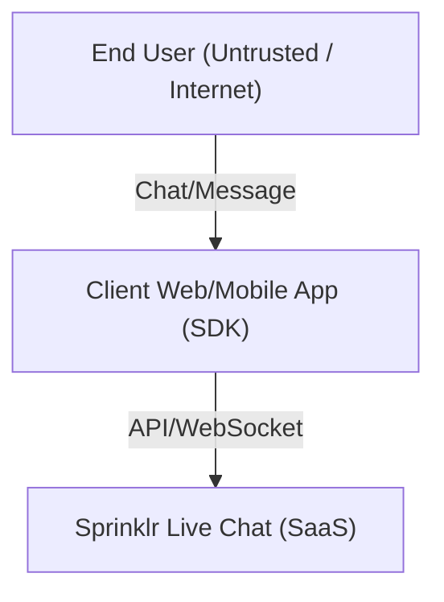
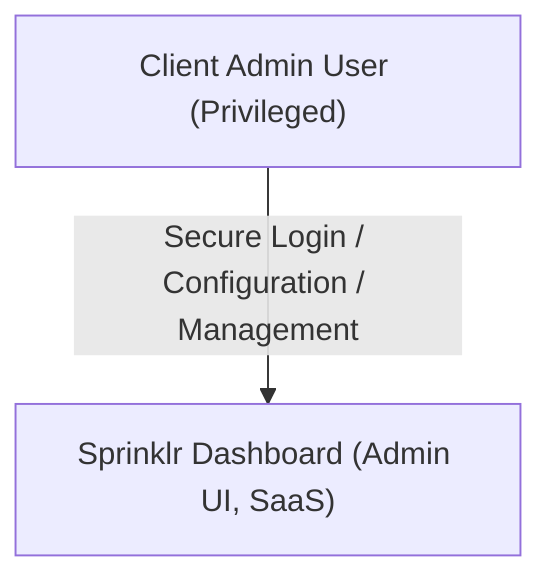
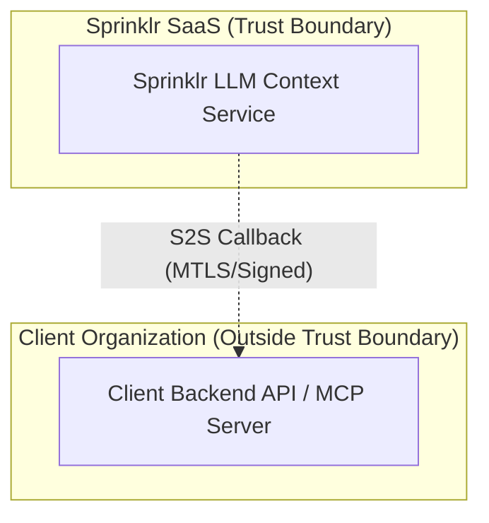

This section defines all trust boundaries identified within the architecture. 

A **trust boundary** is any point where data or control flows across systems or users with differing levels of trust or administrative control. Each boundary introduces potential risks and must be analyzed for controls and mitigations.

Each entry includes:

- **id**: Unique identifier
- **description**: Purpose and flow across the boundary
- **source zone**: Origin of data/control
- **target zone**: Destination of data/control
- **type**: `External`, `Internal`, `Partner`, or `Semi-Trusted`
- **security implications**: Key risks and required controls

---

### 🔸 TB-01: End User → Live Chat (Sprinklr)
- **id**: TB-01  
- **description**: End users interact with Sprinklr’s live chat via frontend web or mobile SDKs.  
- **source zone**: End User (Untrusted / Internet)  
- **target zone**: Sprinklr Live Chat (SaaS)  
- **type**: External  
- **security implications**:
    - MITM Attacks
    - Identity spoofing via JWT/session tokens  
    - Unvalidated message injection (XSS/DoS)  
    - Requires input validation, rate limiting, and session hardening  

**High-Level Data Flow Diagram:**

---

### 🔸 TB-02: Client Admin → Sprinklr Dashboard
- **id**: TB-02  
- **description**: Admin users log into Sprinklr to configure workflows, analytics, and responses.  
- **source zone**: Client Admin (Privileged User)  
- **target zone**: Sprinklr Admin UI (SaaS)  
- **type**: External  
- **security implications**:
    - Session hijacking or phishing  
    - Configuration drift or overprivilege  
    - Enforce MFA, logging, and role-based access  
    - Prompt Injection

**High-Level Data Flow Diagram:**

---

### 🔸 TB-03: Sprinklr LLM → Client API / MCP Server
- **id**: TB-03  
- **description**: LLM makes runtime callbacks to client’s backend for memory/context enrichment.  
- **source zone**: Sprinklr LLM Engine  
- **target zone**: Client MCP API  
- **type**: Partner  
- **security implications**:
    - Request spoofing or replay  
    - Data leakage or poisoning  
    - Requires signed callbacks, MTLS, IP allowlist  

**High-Level Data Flow Diagram (with Trust Boundary):**

*Note: The "subgraph" boxes represent trust boundaries. The dashed arrow (`-.->`) visually indicates a data flow crossing the trust boundary, similar to a dotted line in traditional threat model diagrams. Mermaid does not support arbitrary dotted boxes, but this approach is widely used for trust boundary visualization in Mermaid diagrams.*

---

### 🔸 TB-04: LLM → External Plugin / Tooling
- **id**: TB-04  
- **description**: LLM invokes 3rd-party or customer-approved plugins via APIs for enriched actions.  
- **source zone**: LLM Plugin System  
- **target zone**: Plugin Tooling (e.g., 3rd-party SaaS , OpenAI, Azure, ... )  
- **type**: Semi-Trusted / External  
- **security implications**:
    - Insecure plugin code execution  
    - Data sent to external sources  
    - Vet plugins, apply scopes, and sandbox executions  

---

### 🔸 TB-05: Sprinklr Admin ↔ LLM Prompt Config
- **id**: TB-05  
- **description**: Admins create prompt templates/rules that influence LLM behavior.  
- **source zone**: Sprinklr Admin  
- **target zone**: Prompt Repository  
- **type**: Internal  
- **security implications**:
    - Prompt injection through misconfiguration  
    - Admin abuse or errors  
    - Input validation and version-controlled changes  

---

### 🔸 TB-06: Sprinklr Infra ↔ LLM Subsystem
- **id**: TB-06  
- **description**: Sprinklr internal services invoke the LLM as part of chat or workflow orchestration.  
- **source zone**: Internal Services (e.g., Orchestration Layer)  
- **target zone**: LLM Runtime  
- **type**: Internal  
- **security implications**:
    - Misuse of LLM APIs  
    - Token leakage between systems  
    - Use service identity, token scopes, and logging  

---

### 🔸 TB-07: Trust Boundary Within the System
- **id**: TB-07  
- **description**: Even within Sprinklr’s internal zones, differing trust levels exist (e.g., between stateless orchestration and memory storage, or agent vs. data plane).  
- **source zone**: Higher-privileged Sprinklr Component  
- **target zone**: Lower-privileged Internal Service  
- **type**: Internal (Isolated Trust Domain)  
- **security implications**:
    - Insider lateral movement  
    - Escalation via service misconfig  
    - Enforce inter-service ACLs and mutual auth  

---

