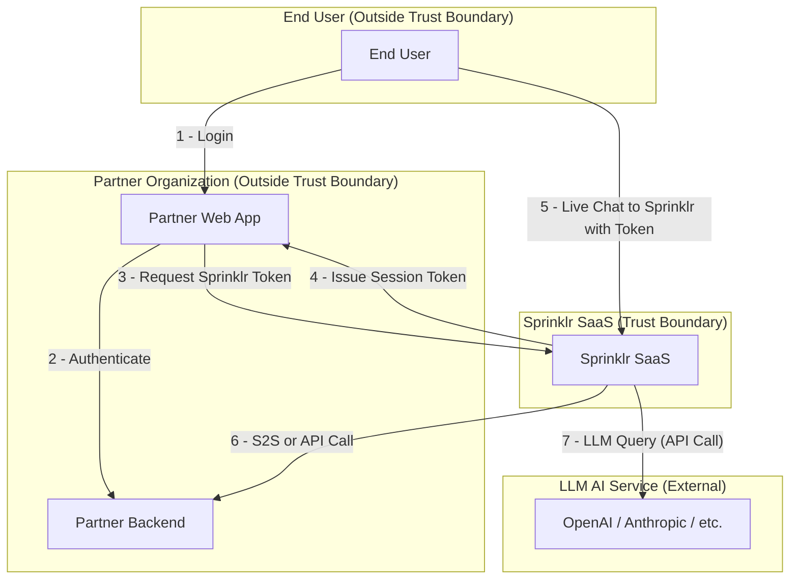

# Threat Modeling Overview

This section provides a summary of the threat modeling approach, key definitions, and high-level architecture and trust boundary diagrams for the Sprinklr Live Chat system.

---

## Purpose

The threat modeling process systematically identifies, analyzes, and mitigates security threats across all major components and data flows in the Sprinklr Live Chat platform. The goal is to ensure robust security controls, data isolation, and compliance throughout the system.

---

## Key Definitions

- **Trust Boundary:** A point where data or control flows across systems or users with differing levels of trust or administrative control.
- **Partner Organization:** An external entity (e.g., bank, retailer) integrating Sprinklr Live Chat into its own applications.
- **End User:** An individual who interacts with the partner’s web or mobile application, typically a customer or internal user.
- **Sprinklr SaaS:** The centralized cloud platform providing live chat, LLM-powered intelligence, dashboards, and integration services.
- **MCP Server:** A partner- or partner-managed backend endpoint supporting personalized data retrieval for LLM agentic flows.

---

## High-Level System Architecture

---

## Threat Modeling Scope

- All Sprinklr-operated services and infrastructure are considered within the trust boundary.
- All other entities—including end users, partner organizations, partner web apps, and partner backends—are considered outside the trust boundary.
- The model assumes a zero-trust approach for all interactions crossing into Sprinklr from external users, systems, or services.

---

## References

- See [Component-Level Threat Analysis](component_threat_analysis.md) for detailed per-component threats and mitigations.
- See [STRIDE Threat Mapping](stride_mapping.md) for threat category mapping.
- See [Data Storage & Compliance](data_compliance.md) for compliance and retention details.
- See [Service Availability & Recovery](availability_recovery.md) for operational resilience.
