# Thread Modeling Report

## Sprinklr Live Chat

---

# Project Details:
**"Sprinklr Live Chat"** is a centralized SaaS platform designed to enable organizations to integrate real-time chat functionality into their web and mobile applications. The platform provides a secure, scalable, and context-aware chat experience, leveraging large language models (LLMs) for intelligent responses and knowledge integration.

# Activity
This document presents a comprehensive threat modeling exercise for the **Sprinklr Live Chat** system. The goal is to systematically identify, analyze, and mitigate security threats across all major components and data flows. The report includes high-level and component-level diagrams, threat analysis, mitigations, and open questions to guide ongoing security improvements.

**Assumptions:**  
- **Sprinklr SaaS** (including all Sprinklr-operated services and infrastructure) is considered **within our trust boundary**.
- All other entities—including **end users**, **partner organizations**, **partner web apps**, and **partner backends** —are considered **outside the trust boundary**.
- The threat model assumes a zero-trust approach for all interactions crossing into Sprinklr from external users, systems, or services.
- The analysis is based on the current system architecture and may require updates as the platform evolves. 

**Note:** For the scope of simplicity, we will restrict our focus on web service and SDK, and mobile SDK . services would be considered out of scope for this activity.

---

# Overview

**Sprinklr Live Chat** is a SaaS platform enabling organizations to integrate real-time chat into their web and mobile applications. 

The system is designed with strong isolation between *end users**, *partner organizations***, and *Sprinklr SaaS****, and leverages LLMs (local models or external API based services) for contextual responses. 

---

# Definitions

## 1. Partner Organization
An organization (e.g., a bank, retailer) that integrates Sprinklr Live Chat into its own web or mobile applications for its customers. Ex: HDFC Bank, ICICI Bank, etc.

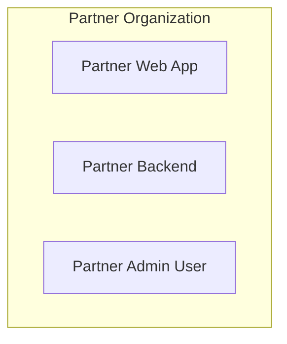

**1.1 Partner Web App:**   
The webapp owned by the partner organization, into which the Sprinklr SDK is embedded.

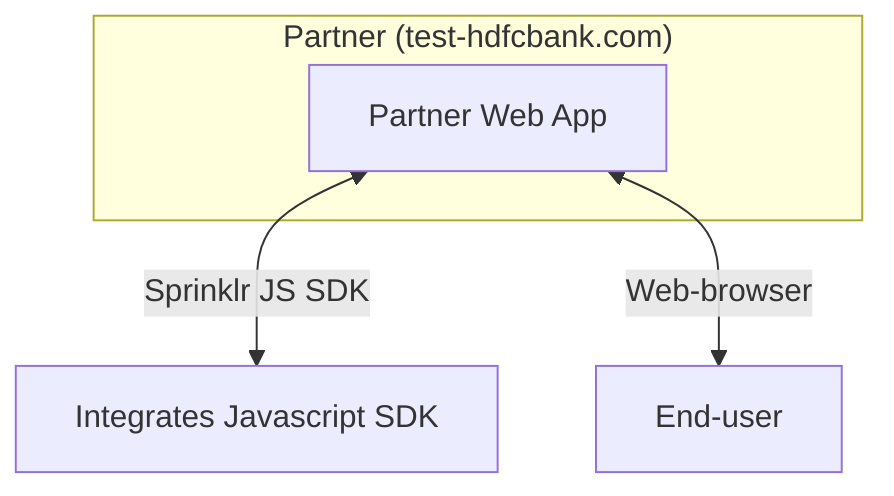

**1.2 Partner Admin User:**  
A user(s) from the partner organization responsible for configuring, managing, and monitoring the Sprinklr integration in their web-app via the Sprinklr Dashboard, upload or update knwoldge graph, FAQs, etc. 

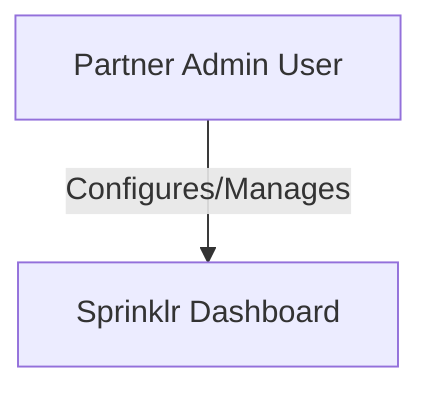

**1.3 Partner Backend**
An API server hosted by the partner organization, exclusively accessible by Sprinklr systems. It provides dynamic user data, session context, and personalized knowledge. It may also include the MCP  server used by Sprinklr LLM Agentic flows to provided personalized response to end-user.

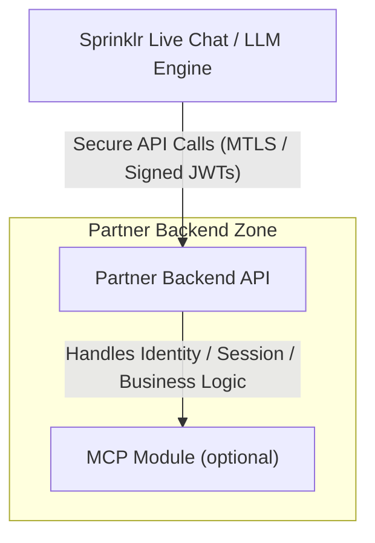

**1.4 Partner's MCP Server:**  (extended & optional component from **1.3**)
A direct API call from Sprinklr’s LLM Context Service to the partner’s backend to retrieve personalized data for an end user query.
The server callback may act to retrive personalized data of the enduser via MCP protocol (if-supported)

## 2. End User

An **End User** is an authorized individual associated with a partner organization who interacts with the partner’s web or mobile application. This user is typically a customer, partner, or internal user of the partner, and has the necessary entitlements to initiate and participate in live chat conversations via the embedded SprinklrSDK.

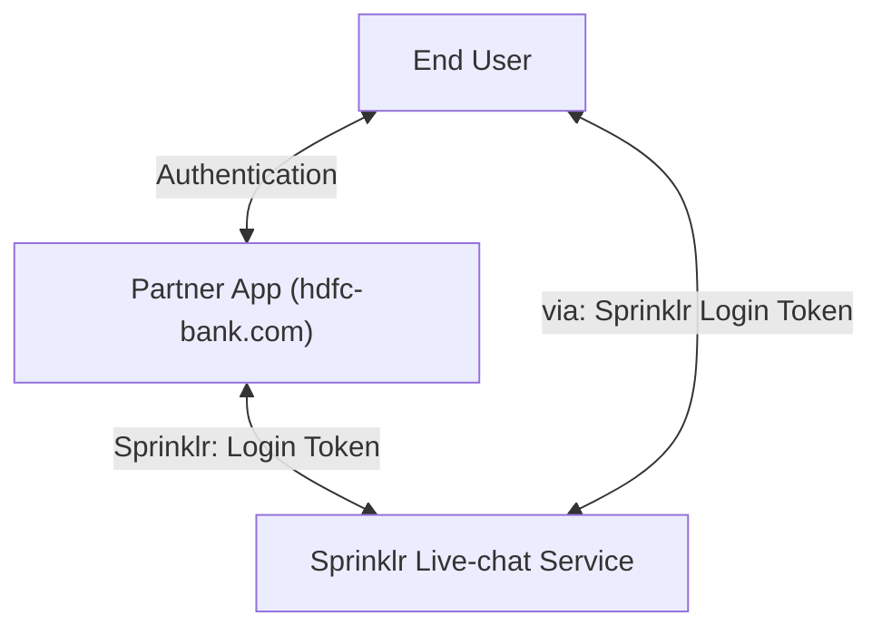

## 3. Sprinklr SaaS:
Sprinklr is a centralized cloud platform offering a comprehensive suite of services, including realtime live chat, LLM-powered intelligence, dashboards for partners to manage integration, etc.. 

This platform unifies all unique services within our trusted system, delivering a cohesive and secure SaaS experience.

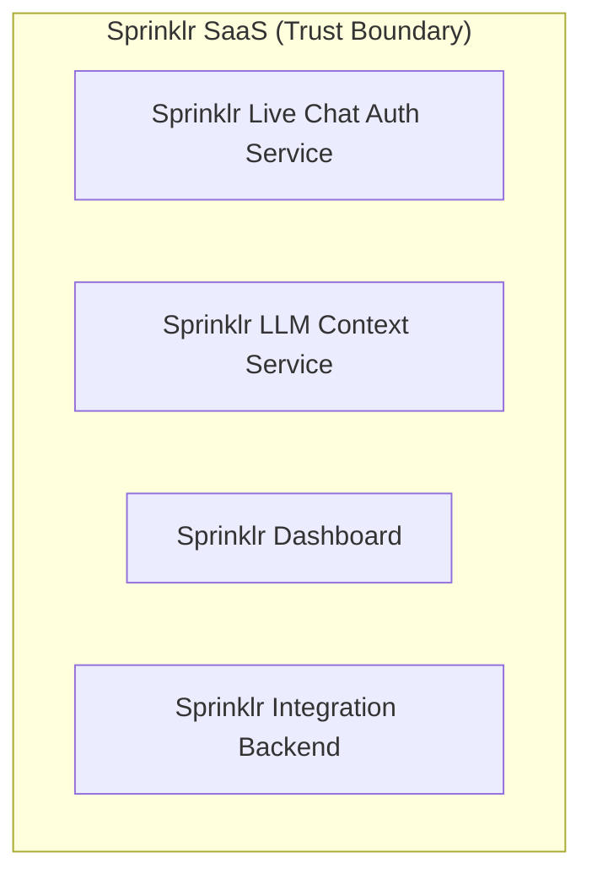
**3.1 Sprinklr Live Chat Auth Service:**   
The backend service within Sprinklr SaaS that manages real-time chat sessions between end users and the system.
The service will be responsible to authenticate, and authorize end-user, and the associated partner, and create a secure websocket channel.

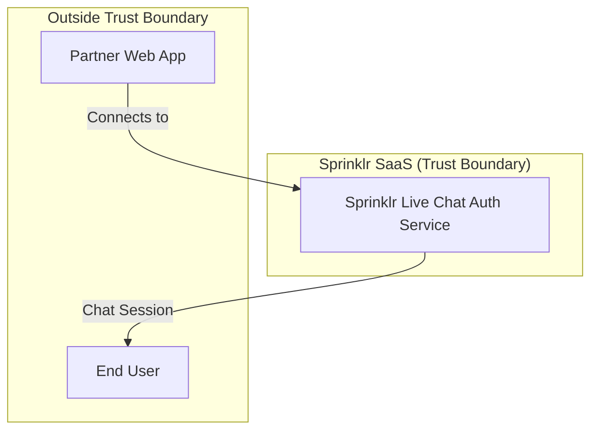

**3.2 Sprinklr LLM Context Service:**   ( Internal Service: Within the trust boundary )
A service that ingests FAQs and knowledge uploads from partners, provides context to the LLM, and may call back to partner backends for personalized data of the end-user.

The messages received from end-user, are processed and a response is generated & is sent back to the end-user.

The service also exposes LLM agent calls that needs to be supported & implemented via partner through a valid MCP protocol. If configured, the servie can execute function çalls to partner's NCP server, and can further process and respond back to partner via live-chat session. 

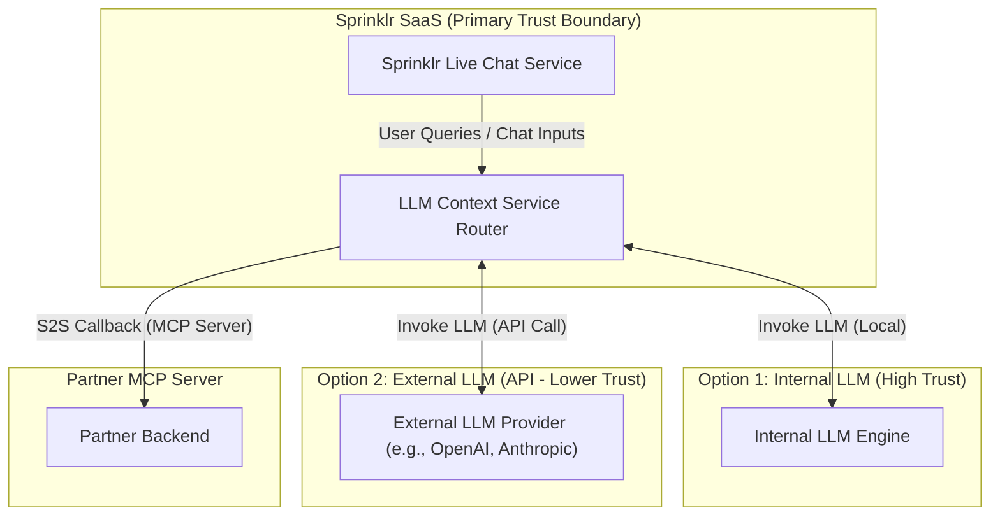

**3.3 Sprinklr Dashboard:**  
A web interface for partner's admin account (Ex: Product Lead from hdfcbank , who would be responsible to integragte & manage sprinklr SDK with the webapp) to onboard, configure, and monitor their Sprinklr integration.

This dashboard provides following features:

1. Whitelist the trusted list of domains and apps, where they would want to integrate Live Chat SDK.

2. The dashboard also provides provosion to configure their  MCP server endpoints, enable / disable personalized queries & function calling.

3. Reset API & Secret Keys.

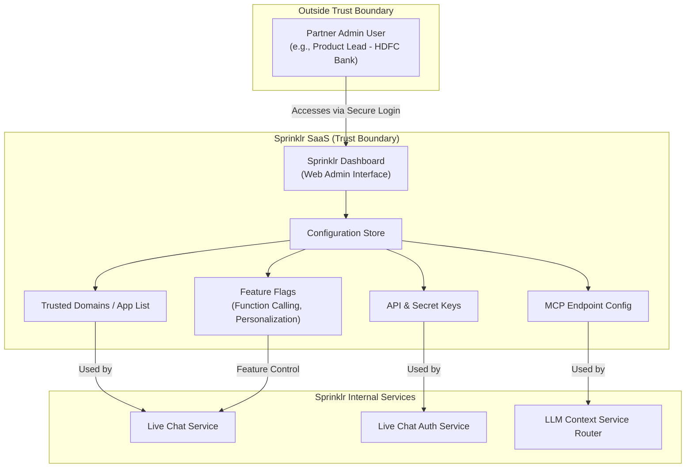

**3.4 Sprinklr Integration Backend:**  
Sprinklr’s backend service for authentication, verification, API key/secret issuance, and integration management.

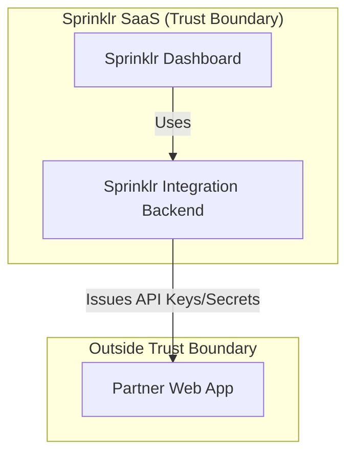

## 🔐 Trust Boundaries – Preface & Definitions

**Trust Boundary:**  

This section defines all trust boundaries identified within the architecture. 

A **trust boundary** is any point where data or control flows across systems or users with differing levels of trust or administrative control. Each boundary introduces potential risks and must be analyzed for controls and mitigations.

Each entry includes:

- **id**: Unique identifier
- **description**: Purpose and flow across the boundary
- **source zone**: Origin of data/control
- **target zone**: Destination of data/control
- **type**: `External`, `Internal`, `Partner`, or `Semi-Trusted`
- **security implications**: Key risks and required controls

---

### 🔸 TB-01: End User → Live Chat (Sprinklr)
- **id**: TB-01  
- **description**: End users interact with Sprinklr’s live chat via frontend web or mobile SDKs.  
- **source zone**: End User (Untrusted / Internet)  
- **target zone**: Sprinklr Live Chat (SaaS)  
- **type**: External  
- **security implications**:
  - MITM Attacks
  - Identity spoofing via JWT/session tokens  
  - Unvalidated message injection (XSS/DoS)  
  - Requires input validation, rate limiting, and session hardening  

**High-Level Data Flow Diagram:**
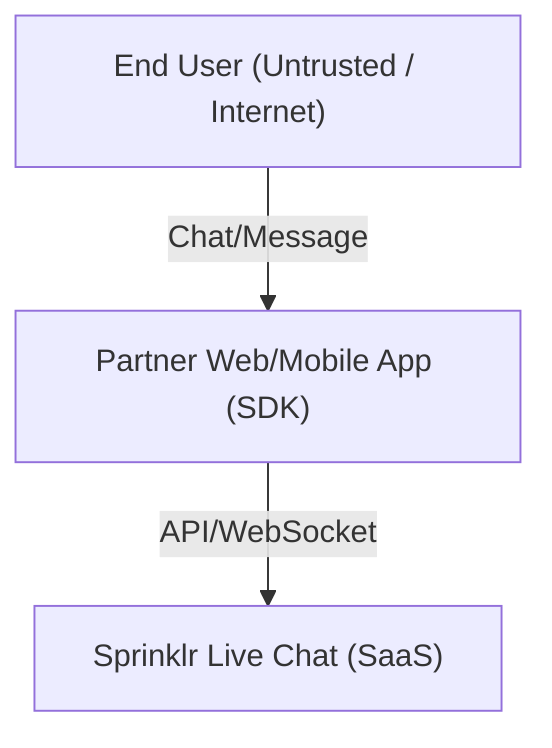
---

### 🔸 TB-02: Partner Admin → Sprinklr Dashboard
- **id**: TB-02  
- **description**: Admin users log into Sprinklr to configure workflows, analytics, and responses.  
- **source zone**: Partner Admin (Privileged User)  
- **target zone**: Sprinklr Admin UI (SaaS)  
- **type**: External  
- **security implications**:
  - Session hijacking or phishing  
  - Configuration drift or overprivilege  
  - Enforce MFA, logging, and role-based access  
  - Prompt Injection

**High-Level Data Flow Diagram:**
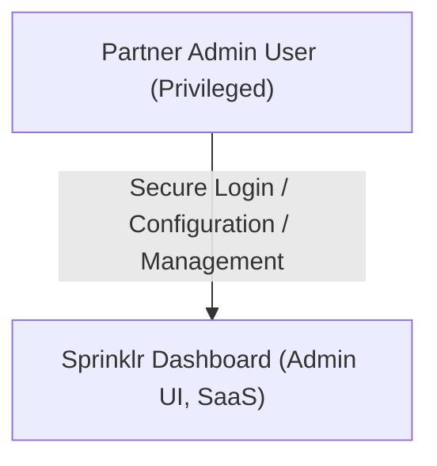
---

### 🔸 TB-03: Sprinklr LLM → Partner API / MCP Server
- **id**: TB-03  
- **description**: LLM makes runtime callbacks to partner’s backend for memory/context enrichment.  
- **source zone**: Sprinklr LLM Engine  
- **target zone**: Partner MCP API  
- **type**: Partner  
- **security implications**:
  - Request spoofing or replay  
  - Data leakage or poisoning  
  - Requires signed callbacks, MTLS, IP allowlist  

**High-Level Data Flow Diagram (with Trust Boundary):**
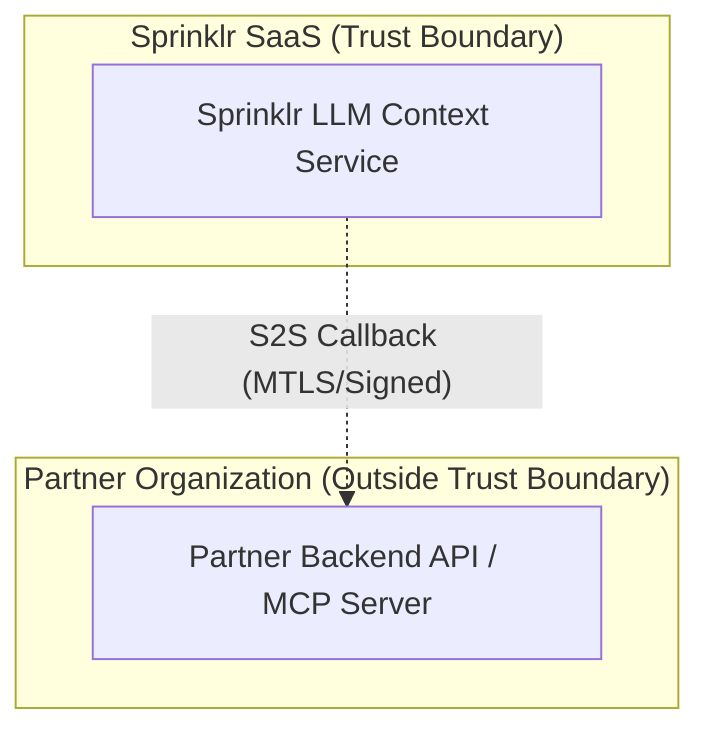
*Note: The "subgraph" boxes represent trust boundaries. The dashed arrow (`-.->`) visually indicates a data flow crossing the trust boundary, similar to a dotted line in traditional threat model diagrams. Mermaid does not support arbitrary dotted boxes, but this approach is widely used for trust boundary visualization in Mermaid diagrams.*
---

### 🔸 TB-04: LLM → External Plugin / Tooling
- **id**: TB-04  
- **description**: LLM invokes 3rd-party or customer-approved plugins via APIs for enriched actions.  
- **source zone**: LLM Plugin System  
- **target zone**: Plugin Tooling (e.g., 3rd-party SaaS , OpenAI, Azure, ... )  
- **type**: Semi-Trusted / External  
- **security implications**:
  - Insecure plugin code execution  
  - Data sent to external sources  
  - Vet plugins, apply scopes, and sandbox executions  

---

### 🔸 TB-05: Sprinklr Admin ↔ LLM Prompt Config
- **id**: TB-05  
- **description**: Admins create prompt templates/rules that influence LLM behavior.  
- **source zone**: Sprinklr Admin  
- **target zone**: Prompt Repository  
- **type**: Internal  
- **security implications**:
  - Prompt injection through misconfiguration  
  - Admin abuse or errors  
  - Input validation and version-controlled changes  

---

### 🔸 TB-06: Sprinklr Infra ↔ LLM Subsystem
- **id**: TB-06  
- **description**: Sprinklr internal services invoke the LLM as part of chat or workflow orchestration.  
- **source zone**: Internal Services (e.g., Orchestration Layer)  
- **target zone**: LLM Runtime  
- **type**: Internal  
- **security implications**:
  - Misuse of LLM APIs  
  - Token leakage between systems  
  - Use service identity, token scopes, and logging  

---

### 🔸 TB-07: Trust Boundary Within the System
- **id**: TB-07  
- **description**: Even within Sprinklr’s internal zones, differing trust levels exist (e.g., between stateless orchestration and memory storage, or agent vs. data plane).  
- **source zone**: Higher-privileged Sprinklr Component  
- **target zone**: Lower-privileged Internal Service  
- **type**: Internal (Isolated Trust Domain)  
- **security implications**:
  - Insider lateral movement  
  - Escalation via service misconfig  
  - Enforce inter-service ACLs and mutual auth  

---

---

# Detailed Report

## 1. High-Level System Architecture

This diagram provides a top-level overview of the main trust boundaries and data flows in the Sprinklr Live Chat system. It illustrates how the End User interacts with the Partner Web App, how authentication and session tokens are managed, and how the Partner Web App and End User communicate with the Sprinklr SaaS platform for live chat functionality. The diagram highlights the separation between partner and Sprinklr trust boundaries and the key steps in the authentication and chat flow.

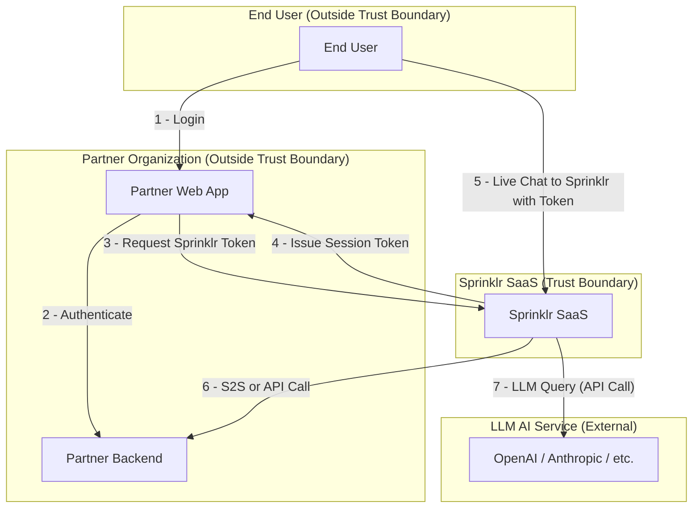

## 2. Sprinklr SaaS Cloud Architecture & Data Flows

This section details the internal cloud architecture of the Sprinklr SaaS platform as deployed on AWS, and the major data flows between its components. These diagrams help identify cloud-specific attack surfaces, trust boundaries, and the secure delivery path for the SDK.

### 2.1 High-Level AWS System Architecture

The following diagram shows the main AWS infrastructure components used by Sprinklr SaaS, including load balancers, API gateways, compute clusters, storage, caching, logging, and the use of S3 and CloudFront for secure SDK delivery. WebSocket connections for live chat are supported via the Application Load Balancer (ALB) and routed to the ECS/EKS app services. This view is essential for understanding network segmentation, service isolation, and the entry points for both API and static asset requests.

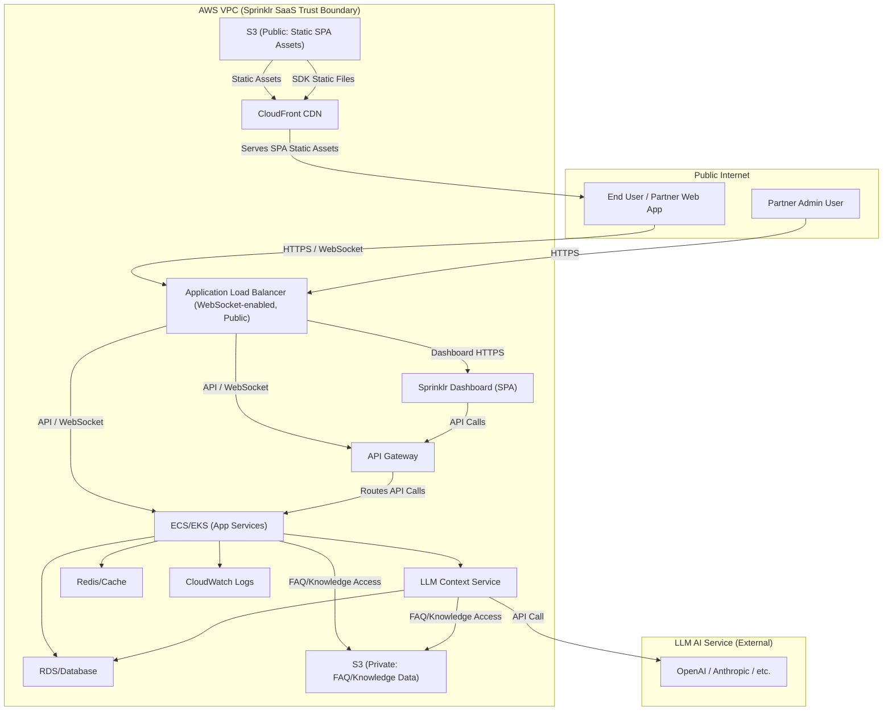

### 2.2 Data Flow Diagram (DFD)

This diagram illustrates the flow of data between the main actors and services in the Sprinklr SaaS platform, including user authentication, chat session management, LLM context queries, S2S/API calls, and the secure delivery of the SDK via CloudFront and S3. It highlights the key integration points and the movement of sensitive data across trust boundaries.

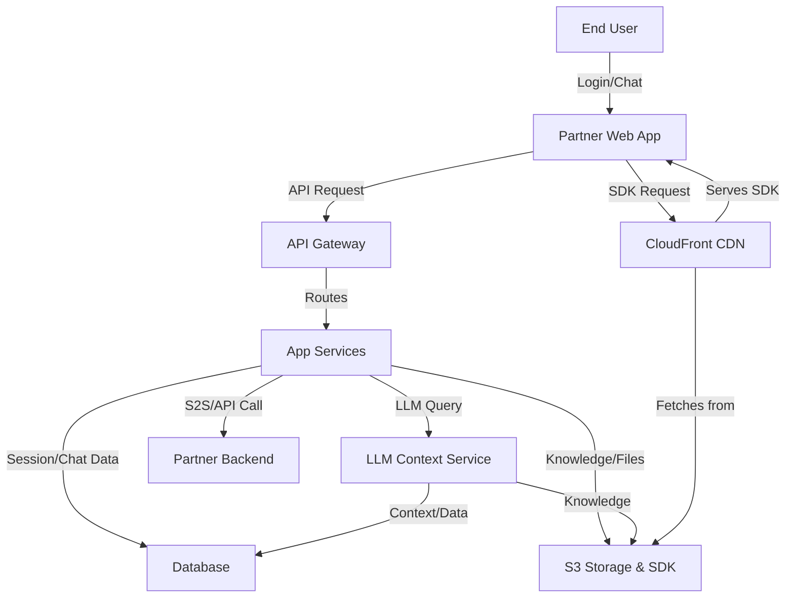

## 3. Component-Level Analysis

### 2.1 End User Devices

**Threats:**
- Device compromise (malware, root/jailbreak, keyloggers)
- Session hijacking (stolen tokens, browser vulnerabilities)
- Phishing (credential theft, fake login pages)
- Session token compromise via XSS on partner domain if Sprinklr tokens are stored in localStorage or cookies
- Use of outdated or insecure browsers

**Mitigations:**
- Secure tokens (short-lived, bound to device/browser)
- HTTPS enforced for all communications
- User education and anti-phishing guidance
- Sprinklr session tokens must be stored only in memory (never in localStorage or cookies)
- Document and enforce this in SDK and integration guides
- Warn users on outdated/insecure browsers

**Known Security Gaps / Limitations:**
- Device-level compromise (malware/root) may bypass all browser-based controls
- Reliance on partner browser security for XSS/CSRF protection
- User behavior (e.g., falling for phishing) is hard to control

**Potential Impact / Failure Scenarios:**
- Compromised device can leak session tokens, credentials, or chat data
- Phishing may result in account takeover or impersonation
- XSS on partner domain could expose Sprinklr session tokens if not properly protected

**Incident Response & Monitoring:**
- Monitor for anomalous login/session activity
- Alert on multiple device logins or suspicious geolocations
- Provide rapid session/token revocation on suspected compromise

**Dependencies:**
- Partner browser security and update process
- User security awareness
- Sprinklr SDK session management

### 2.2 Partner Web App

**Threats:**
- XSS/CSRF
- Supply chain (SDK)
- API key leakage
- Unauthorized SDK use by unapproved partners/domains
- Dependency compromise

**Mitigations:**
- CSP
- Input validation
- SDK integrity checks
- Strict CORS policy
- Domain whitelisting
- Signed SDK delivery
- Subresource integrity (SRI)
- Regular dependency audits

**Known Security Gaps / Limitations:**
- If the partner app is compromised (e.g., via XSS), Sprinklr session tokens in memory may still be at risk.
- Reliance on partner-side enforcement for domain whitelisting and CORS; misconfiguration can expose APIs or SDK.
- Supply chain attacks on dependencies may not be detected immediately.
- If a partner app bans or revokes an end user's access during an active session, the user may continue to interact with Sprinklr until their short-lived session token expires (token revocation lag).

**Potential Impact / Failure Scenarios:**
- Successful XSS or supply chain attack could allow attackers to impersonate users, steal tokens, or manipulate chat.
- Misconfigured CORS or domain whitelist could allow unauthorized access to Sprinklr APIs or SDK.
- Dependency compromise could introduce malicious code into the partner app.
- Banned or deprovisioned users may retain access to live chat for the duration of their valid session token, potentially violating partner policy or compliance requirements.

**Incident Response & Monitoring:**
- Monitor for anomalous API usage patterns and failed CORS/domain checks.
- Alert on unusual SDK download patterns or integrity check failures.
- Rapidly revoke/rotate API keys and session tokens if compromise is detected.

**Dependencies:**
- Partner browser security (XSS, CSP enforcement)
- Sprinklr SDK integrity and update process
- External package registries (npm, etc.)
- Sprinklr API and authentication endpoints

### 2.3 Partner Admin Users

**Threats:**
- Credential theft (phishing, malware, password reuse)
- Privilege escalation (misconfigured roles, dashboard bugs)
- Session hijacking
- Insider threats (malicious or negligent admin actions)
- API key/secret leakage
- Social engineering attacks targeting admin users

**Mitigations:**
- Enforce MFA for all admin logins
- Role-based access control (RBAC) with least privilege
- Backend-enforced IP whitelisting per organization/vendor for dashboard access
- Strong password policies and periodic rotation
- Secure session management (short TTL, inactivity timeout)
- Audit logging of all admin actions and configuration changes
- Regular review of admin accounts and privileges
- User education and anti-phishing training

**Known Security Gaps / Limitations:**
- If an admin account is compromised, attacker may have broad access until detected and revoked
- Reliance on partner organization to promptly deprovision former admins
- Social engineering attacks may bypass technical controls

**Potential Impact / Failure Scenarios:**
- Compromised admin account could lead to unauthorized configuration changes, API key/secret exposure, or disabling of security controls
- Privilege escalation could allow a lower-privileged user to gain admin access
- Insider threat could result in intentional or accidental data leakage or service disruption

**Incident Response & Monitoring:**
- Monitor and alert on suspicious admin activity (e.g., logins from new locations, privilege changes, mass config updates)
- Alert on access attempts from non-whitelisted IPs
- Immediate revocation of compromised admin accounts and rotation of exposed secrets
- Regular review of audit logs for anomalous or unauthorized actions
- Defined escalation and recovery procedures for admin account compromise

**Dependencies:**
- Identity provider and authentication mechanisms (MFA, SSO)
- Secure dashboard implementation and RBAC enforcement
- Accurate org/vendor IP inventory and backend IP whitelisting enforcement
- Timely communication from partner organizations regarding admin personnel changes
### 2.4 Sprinklr Live Chat Service

**Threats:**
- WebSocket hijacking
- DOS / DDoS Attacks
- Cross-tenant leakage
- Session persistence after partner-side user ban/revocation
- Multiple simultaneous sessions by the same user (potential DoS/DDoS/resource exhaustion)

**Mitigations:**
- TLS
- Session authentication
- Tenant isolation
- Hidden CAPTCHA and bot detection to prevent automated abuse and bot-driven DoS
- Support for short-lived tokens and, if feasible, real-time token revocation or session invalidation
- Enforce only one active live chat session per end user

**Known Security Gaps / Limitations:**
- If a partner revokes or bans a user's access during an active chat session, the user may continue to interact with Sprinklr until their session token expires, unless real-time revocation is implemented.

**Potential Impact / Failure Scenarios:**
- Banned or deprovisioned users from a partner, may still continue to access live chat, potentially leading to compliance or abuse issues.
- Multiple active sessions for a single user could be abused to exhaust system resources or disrupt service availability.

**Incident Response & Monitoring:**
- Monitor for chat activity from users recently deprovisioned by the partner.
- Provide mechanisms for partners to request immediate session invalidation if required.

**Dependencies:**
- Partner-side user management and ban/revocation logic
- Sprinklr session token TTL and revocation mechanisms

### 2.5 LLM Context Service

**Threats:**
- Malicious uploads (poisoned FAQ/knowledge, prompt injection)
- Chat messages from user can also lead to prompt injection
- Data poisoning (intentional or accidental)
- LLM output leakage (sensitive data exposure)
- Abuse of LLM agentic flows (unintended function calls)
- Excessive or malformed requests (DoS)

**Mitigations:**
- Upload validation and sanitization for all partner-provided data
- LLM output monitoring and filtering for sensitive data
- Add and maintain an internal LLM guardrail layer on top of local or external LLM services to prevent prompt injection and enforce policy
- End-user-based isolation to prevent cross-user/tenant data leakage
- Rate limiting and quotas on LLM queries
- Least privilege for LLM agentic flows (function whitelisting)
- Audit logging of uploads and LLM queries

**Known Security Gaps / Limitations:**
- LLMs may still leak sensitive data if prompt/output filtering is bypassed
- New LLM vulnerabilities may emerge (prompt injection, jailbreaks)
- Reliance on partner to provide clean, non-malicious data

**Potential Impact / Failure Scenarios:**
- Data poisoning could degrade LLM accuracy or cause harmful outputs
- Sensitive data leakage via LLM responses
- LLM agentic flows could trigger unintended actions

**Incident Response & Monitoring:**
- Monitor for anomalous LLM queries and outputs
- Alert on upload of suspicious or malformed data
- Rapid rollback of poisoned knowledge uploads

**Dependencies:**
- LLM provider security and update process
- Partner data hygiene
- Sprinklr upload validation and monitoring

### 2.6 Sprinklr Dashboard & Integration Backend

**Threats:**
- XSS/CSRF in dashboard UI
- API key/secret leakage (in logs, browser, or config)
- Insider threats (malicious or negligent admin actions)
- Privilege escalation via dashboard bugs
- Misconfiguration leading to exposure of sensitive data or APIs

**Mitigations:**
- Secure coding practices (input validation, output encoding)
- Strong authentication (MFA, SSO)
- Audit logging of all admin/config actions
- RBAC and least privilege for dashboard users
- Secure storage and handling of API keys/secrets
- Regular security reviews and penetration testing

**Known Security Gaps / Limitations:**
- Insider threats may bypass technical controls
- Reliance on timely deprovisioning of admin users
- Complex configuration may lead to accidental exposure

**Potential Impact / Failure Scenarios:**
- XSS/CSRF could allow attacker to hijack admin sessions or modify config
- API key/secret leakage could compromise partner integrations
- Misconfiguration could expose sensitive data or APIs

**Incident Response & Monitoring:**
- Monitor and alert on suspicious dashboard activity
- Immediate revocation of compromised admin accounts or secrets
- Regular review of audit logs and config changes

**Dependencies:**
- Secure dashboard implementation and update process
- Identity provider (MFA, SSO)
- Timely communication from partner organizations regarding admin changes

### 2.7 S2S LLM Callback to Partner Backend

**Threats:**
- Unauthorized S2S access (spoofed Sprinklr calls)
- Data leakage (sensitive data in callback)
- Token hijack from a legit user can expose sensitive information from the user
- Replay or injection attacks
- Callback flooding (DoS)
- Misconfigured callback endpoints

**Mitigations:**
- Mutual TLS (mTLS) for all S2S callbacks
- Strict validation of callback data and endpoints
- For sensitive/customer-specific information, do not fetch directly via S2S; instead, send a redirection/request to the end user, who forwards it to the partner backend, preserving compliance and reducing risk of exposure
- Rate limiting and quotas on callback requests
- Signed requests and nonces to prevent replay/injection
- Allowlisting of partner callback endpoints

**Known Security Gaps / Limitations:**
- Reliance on partner to secure their backend and endpoints
- Callback endpoint misconfiguration may expose data
- mTLS certificate management complexity

**Potential Impact / Failure Scenarios:**
- Unauthorized access to partner backend or data leakage
- Callback flooding could disrupt partner backend availability
- Replay/injection could result in unauthorized actions

**Incident Response & Monitoring:**
- Monitor and alert on failed or suspicious callback attempts
- Rapid revocation of mTLS certificates on compromise
- Regular review of callback endpoint configuration

**Dependencies:**
- Partner backend security and endpoint management
- Sprinklr mTLS certificate management
- Callback validation and monitoring

---

### 2.8 Sprinklr SDK Security & Supply Chain

- **Feature: Automatic SDK Updates (Hot Patching)**
  - The Sprinklr SDK is delivered via a central CDN URL (e.g., CloudFront/S3). By updating the SDK at this location, all partner web apps automatically receive the latest version without requiring code changes or redeployment by the partner.
  - This enables rapid rollout of security hot patches and critical fixes in response to emerging threats.

- **Threats:**
  - Supply chain attacks (malicious/tampered SDK, compromised dependencies)
  - Unauthorized use of SDK by unapproved partners/domains
  - SDK delivery via insecure channels (MITM, spoofing)
  - Compromise of the SDK delivery pipeline could instantly impact all partners
  - Unintended breaking changes or regressions due to auto-update

- **Mitigations:**
  - Serve SDK only over HTTPS with strong authentication and access control
  - Use signed SDK bundles and enforce subresource integrity (SRI) in partner apps
  - Maintain a domain/app whitelist for SDK access (enforced at delivery and runtime)
  - Harden CSP and CORS policies to restrict resource loading and cross-origin requests
  - Regularly audit SDK dependencies and monitor for vulnerabilities
  - Provide versioned SDKs and deprecate insecure versions promptly
  - Audit logging and alerting for all SDK updates
  - Strict access controls and multi-party approval for SDK publishing
  - Option for partners to pin SDK versions for stability/compliance, with clear communication protocol for emergency hot patches

---

# STRIDE Threat Mapping

The following table maps each major component to the STRIDE threat categories, indicating which threats are relevant and summarizing key mitigations.

| Component / Flow                | S | T | R | I | D | E | Key Mitigations |
|---------------------------------|---|---|---|---|---|---|-----------------|
| End User Devices                | ✔ | ✔ |   | ✔ | ✔ |   | Secure tokens, HTTPS, user education, session validation |
| Partner Web App                  | ✔ | ✔ | ✔ | ✔ | ✔ | ✔ | CSP, input validation, SDK integrity, RBAC, audit logs, SRI, CORS, domain whitelisting |
| Partner Admin Users              | ✔ | ✔ | ✔ | ✔ | ✔ | ✔ | MFA, RBAC, audit logs, secure login, session management |
| Sprinklr Live Chat Service      | ✔ | ✔ | ✔ | ✔ | ✔ | ✔ | TLS, session auth, tenant isolation, logging, quotas |
| LLM Context Service             | ✔ | ✔ |   | ✔ | ✔ | ✔ | Upload validation, output monitoring, least privilege, S2S auth |
| Sprinklr Dashboard & Integration| ✔ | ✔ | ✔ | ✔ | ✔ | ✔ | Secure coding, strong auth, audit logs, input validation |
| S2S LLM Callback to Partner      | ✔ | ✔ | ✔ | ✔ | ✔ | ✔ | Mutual TLS, strict validation, rate limiting, signed callbacks |
| SDK Delivery & Supply Chain     | ✔ | ✔ | ✔ | ✔ | ✔ | ✔ | Signed SDK, SRI, CORS, CSP, dependency audits, domain whitelisting |

Legend:  
S = Spoofing, T = Tampering, R = Repudiation, I = Information Disclosure, D = Denial of Service, E = Elevation of Privilege

---

# Detailed STRIDE Threat Mapping

Below, each major component/flow is mapped to the six STRIDE categories, with explicit threats and mitigations.

---

## Partner Web App

| STRIDE Category         | Threats                                                                 | Mitigations                                                      |
|------------------------|-------------------------------------------------------------------------|------------------------------------------------------------------|
| Spoofing               | Session hijacking, fake login pages, token theft                        | Secure login, HTTPS, session validation, anti-phishing measures  |
| Tampering              | Malicious script injection, DOM manipulation, SDK tampering             | CSP, input validation, SRI, signed SDK, dependency audits        |
| Repudiation            | Users denying actions (e.g., chat sent, config changed)                 | Audit logs, non-repudiation tokens, user action tracking         |
| Information Disclosure | XSS, leaking chat data, API key exposure, improper CORS                 | Output encoding, CORS/CSP hardening, access controls, encryption |
| Denial of Service      | Resource exhaustion, browser DoS, SDK abuse                             | Rate limiting, input validation, quotas, SDK throttling          |
| Elevation of Privilege | Privilege escalation via vulnerable SDK or misconfig                    | RBAC, least privilege, secure SDK delivery, config validation    |

---

## Sprinklr Live Chat Service

| STRIDE Category         | Threats                                                                 | Mitigations                                                      |
|------------------------|-------------------------------------------------------------------------|------------------------------------------------------------------|
| Spoofing               | Forged session tokens, impersonation of users/partners                   | Strong token validation, mTLS, session management                |
| Tampering              | Message alteration, unauthorized config changes                         | Input validation, config integrity checks, audit logs            |
| Repudiation            | Users/partners denying chat actions or config changes                    | Audit logs, signed actions, trace IDs                            |
| Information Disclosure | Cross-tenant data leakage, log exposure, improper access                | Tenant isolation, access controls, encrypted logs                |
| Denial of Service      | Flooding chat service, resource exhaustion                              | Rate limiting, quotas, auto-scaling, DoS protection              |
| Elevation of Privilege | Service misconfig, privilege escalation via API                         | RBAC, least privilege, config validation                        |

---

## LLM Context Service

| STRIDE Category         | Threats                                                                 | Mitigations                                                      |
|------------------------|-------------------------------------------------------------------------|------------------------------------------------------------------|
| Spoofing               | Forged S2S calls, fake partner backends                                  | mTLS, signed requests, allowlists                                |
| Tampering              | Malicious uploads, prompt injection, data poisoning                     | Upload validation, prompt sanitization, input checks             |
| Repudiation            | Denial of LLM actions or S2S calls                                      | Audit logs, signed requests, traceability                        |
| Information Disclosure | LLM leaking sensitive data, improper callback data                      | Output filtering, data minimization, access controls             |
| Denial of Service      | Malicious uploads, LLM abuse, callback flooding                         | Rate limiting, input validation, quotas                          |
| Elevation of Privilege | LLM agentic flows invoking unauthorized actions                         | Function whitelisting, least privilege, config review            |

---

## Sprinklr Dashboard & Integration Backend

| STRIDE Category         | Threats                                                                 | Mitigations                                                      |
|------------------------|-------------------------------------------------------------------------|------------------------------------------------------------------|
| Spoofing               | Admin impersonation, session hijacking                                  | MFA, secure login, session validation                            |
| Tampering              | Unauthorized config changes, API key manipulation                       | Audit logs, config integrity, access controls                    |
| Repudiation            | Denial of admin actions, config changes                                 | Audit logs, signed actions, traceability                         |
| Information Disclosure | API key leakage, config data exposure                                   | Access controls, encryption, audit logs                          |
| Denial of Service      | Flooding dashboard APIs, resource exhaustion                            | Rate limiting, quotas, monitoring                                |
| Elevation of Privilege | Privilege escalation via dashboard bugs                                 | RBAC, least privilege, secure coding                             |

---

## S2S LLM Callback to Partner Backend

| STRIDE Category         | Threats                                                                 | Mitigations                                                      |
|------------------------|-------------------------------------------------------------------------|------------------------------------------------------------------|
| Spoofing               | Fake Sprinklr calls to partner backend                                   | mTLS, signed requests, allowlists                                |
| Tampering              | Callback data alteration, replay attacks                                | Nonces, input validation, signed requests                        |
| Repudiation            | Denial of callback actions                                              | Audit logs, signed requests, traceability                        |
| Information Disclosure | Sensitive data leakage in callback                                      | Data minimization, access controls, encrypted transport          |
| Denial of Service      | Callback flooding, resource exhaustion                                  | Rate limiting, quotas, monitoring                                |
| Elevation of Privilege | Callback invoking unauthorized partner actions                           | Function whitelisting, least privilege, config review            |

---

## SDK Delivery & Supply Chain

| STRIDE Category         | Threats                                                                 | Mitigations                                                      |
|------------------------|-------------------------------------------------------------------------|------------------------------------------------------------------|
| Spoofing               | Fake SDK delivery, MITM attacks                                         | HTTPS-only, signed SDK, SRI, domain whitelisting                 |
| Tampering              | Malicious SDK modification, dependency compromise                       | Signed SDK, SRI, dependency audits, version pinning              |
| Repudiation            | Denial of SDK delivery or update actions                                | Audit logs, signed delivery, traceability                        |
| Information Disclosure | SDK leaking data, dependency exfiltration                               | Output filtering, access controls, dependency review             |
| Denial of Service      | SDK delivery disruption, dependency DoS                                 | CDN redundancy, monitoring, fallback versions                    |
| Elevation of Privilege | SDK or dependency privilege escalation                                  | Least privilege, secure coding, dependency review                |

---

# Data Storage & Compliance Considerations

## A. Data Inventory

---

# Service Availability, Disruption & Recovery

## A. Availability Threats

- **Denial of Service (DoS/DDoS):** Attackers may attempt to overwhelm Sprinklr Live Chat or partner endpoints.
- **Infrastructure Failure:** Cloud provider outages, network partitioning, or hardware failures.
- **Software Bugs/Deployment Issues:** Faulty releases or misconfigurations causing service downtime.
- **Third-Party Dependency Outages:** LLM API providers, plugin services, or partner backends becoming unavailable.

## B. Mitigations

- **Redundancy & High Availability:** Multi-region deployment, load balancing, and failover for critical services.
- **Auto-Scaling & Rate Limiting:** Elastic scaling to absorb traffic spikes; rate limiting to prevent abuse.
- **Monitoring & Alerting:** Real-time health checks, synthetic monitoring, and alerting for anomalies.
- **Backups & Disaster Recovery:** Regular backups of critical data; tested DR plans for rapid restoration.
- **Graceful Degradation:** Fallback to basic chat or cached knowledge if LLM or partner backend is unavailable.

## C. Recovery & Operational Action Plan

- **Incident Response:** Defined escalation paths, on-call rotations, and runbooks for common failure scenarios.
- **RTO/RPO Targets:** Documented Recovery Time Objective (RTO) and Recovery Point Objective (RPO) for each service.
- **Failover Procedures:** Automated and manual failover steps for regional or component-level outages.
- **Communication:** Stakeholder and partner notification protocols during major incidents.
- **Postmortem & Continuous Improvement:** Root cause analysis and remediation tracking after disruptions.

## D. Open Questions & Gaps

- Are DR and failover plans regularly tested and updated?
- Are all critical dependencies monitored for availability?
- Are SLAs/SLOs defined and communicated to partners?
- Is there a clear process for partner notification and support during outages?
- Are lessons learned from incidents fed back into operational improvements?

---

| Data Type         | Stored In                | Trust Boundary      | Compliance Req.         | Retention Policy | Encryption | Deletion/Access |
|-------------------|-------------------------|---------------------|-------------------------|------------------|------------|----------------|
| Chat Logs         | Sprinklr DB             | Internal (Trusted)  | GDPR, CCPA, Audit       | 90 days (default) | Yes        | On request     |
| User Profiles     | Partner Backend          | External (Partner)   | Partner's responsibility | N/A              | N/A        | N/A            |
| Uploaded FAQ/Knowledge | LLM Context Store  | Internal (Trusted)  | GDPR, CCPA              | Until deleted    | Yes        | On request     |
| Session Tokens    | Browser/Sprinklr Auth   | Mixed               | Secure storage, expiry  | Short-lived      | Yes        | Auto-expiry    |
| API Keys/Secrets  | Sprinklr Vault/Partner   | Mixed               | Secure storage, rotation| Until rotated    | Yes        | On rotation    |
| Audit Logs        | Sprinklr Logging        | Internal (Trusted)  | Audit, GDPR             | 1 year           | Yes        | On request     |
| User Data Fetched via S2S/LLM Agent | Sprinklr Memory/Cache (Ephemeral) | Internal (Trusted)  | GDPR, CCPA, Purpose Limitation | Ephemeral (request scope only) | Yes (in transit & at rest) | Deleted after use (no persistent storage) |

## B. Compliance Matrix

| Component                    | GDPR | CCPA | Data Residency | Retention | Deletion | Auditability |
|------------------------------|------|------|---------------|-----------|----------|--------------|
| Sprinklr Live Chat Service   |  ✔   |  ✔   |   ✔ (config)  |   ✔       |   ✔      |     ✔        |
| LLM Context Service          |  ✔   |  ✔   |   ✔ (config)  |   ✔       |   ✔      |     ✔        |
| Sprinklr Dashboard           |  ✔   |  ✔   |   ✔           |   ✔       |   ✔      |     ✔        |
| Integration Backend          |  ✔   |  ✔   |   ✔           |   ✔       |   ✔      |     ✔        |
| Partner Backend               |  ✖   |  ✖   |   Partner      |   Partner  |  Partner  |   Partner     |

## C. Key Risks & Mitigations

- **Supply Chain & SDK Delivery Attacks:**
  - Mitigation: Signed SDK delivery, SRI enforcement, strict domain whitelisting, secure HTTPS-only distribution, regular dependency audits, and rapid response to discovered vulnerabilities. Harden CSP and CORS policies to prevent unauthorized resource loading and cross-origin attacks.
- **Unauthorized Data Access:**  
  - Mitigation: Encryption at rest, strict access controls, audit logging.
- **Improper Data Retention/Deletion:**  
  - Mitigation: Automated retention policies, user-initiated deletion, compliance reviews.
- **Cross-Border Data Transfer:**  
  - Mitigation: Data residency controls, region-aware storage, contractual safeguards.
- **Lack of User Consent:**  
  - Mitigation: Consent management in partner apps, clear privacy policies.
- **Data Leakage via LLM/Agentic Flows or S2S Fetched Data:**  
  - Mitigation: Output filtering, data minimization, ephemeral storage, strict purpose limitation, and immediate deletion after use. Ensure no persistent logging of sensitive user data fetched from partner backends.
- **Cryptographic Isolation Failure (Key/Cert Leakage):**
  - Mitigation: Per-tenant key management, strict logical and physical separation of keys/certs, automated rotation, and monitoring. Compromise of one partner's keys or mTLS certificates must not impact other tenants. Use hardware security modules (HSMs) or secure enclaves for key storage where possible.

## D. Open Compliance Questions

- Are all data flows and storage locations documented and reviewed for compliance?
- How is user consent for data processing and storage obtained and tracked?
- Are data residency requirements configurable per partner/tenant?
- What is the process for fulfilling data subject access/deletion requests (DSARs)?
- How are compliance controls tested and audited?
- How is user data fetched via S2S/LLM Agentic flows handled, logged, and deleted? Is there any risk of inadvertent persistence or logging of sensitive data? Are ephemeral storage and deletion controls auditable?
- How is cryptographic isolation enforced between tenants? What is the process for detecting, containing, and remediating a key or certificate compromise for a single partner, and how is blast radius minimized?
---

## 3. Data Flow Diagrams

(See attached diagrams for each group and component)

---

## 4. Threat Model Summary

- **Authentication & Authorization:** Strong tokens, MFA, RBAC
- **Data Isolation:** Per-tenant isolation at all layers
- **Real-Time Communication:** TLS, session validation, quotas
- **LLM Context & S2S:** Input validation, least privilege, monitoring
- **Incident Response:** Logging, anomaly detection, key rotation

---

## 5. Open Questions & Gaps

- Third-party integrations, mobile-specific threats, incident response process
- Key management, privacy compliance, LLM abuse controls
- S2S endpoint scoping and authentication

---

_This report should be reviewed and updated as the system evolves and new features or integrations are added._
