# 

# High-Level Architecture: Sprinklr Live Chat (Trust Boundaries & Isolation)

This diagram provides a high-level view of the main isolated components and trust boundaries in the Sprinklr Live Chat system, focusing on the relationships between the End User, Client, and Sprinklr SaaS.

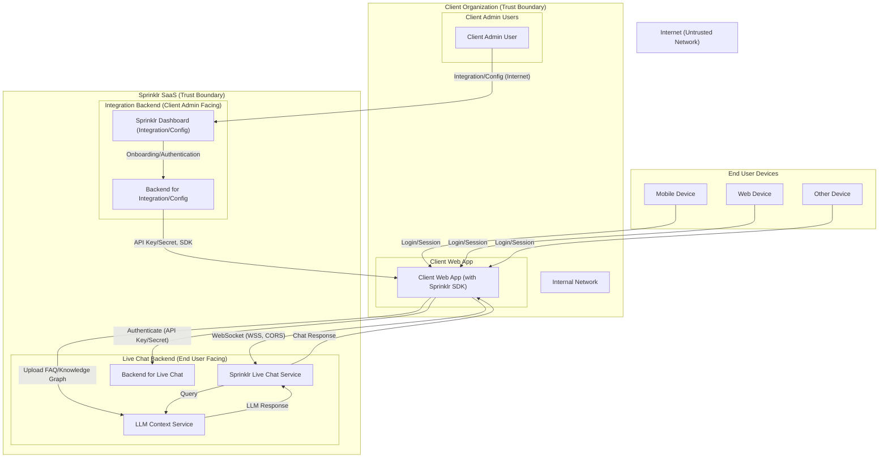

**Key Points:**
- Each subgraph represents a trust boundary: End User, Client Organization, and Sprinklr SaaS.
- All flows crossing boundaries are labeled and show the direction of trust and data.
- This diagram is more abstract and focused on trust/isolation than previous detailed DFDs.

---

## Component-Level Breakdown, Diagrams, and Threat Model Templates

---

### 1. End User Devices

#### 1.1 Mobile Device

**Description:**  
A smartphone or tablet used by the end user to access the client web app.

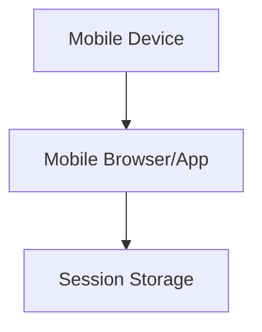

**Threat Model Template:**
- **Threats:**
  - Device compromise (malware, rooting/jailbreak)
  - Insecure app/browser
  - Session hijacking
  - Phishing attacks
- **Mitigations:**
  - Encourage OS/app updates
  - Use secure cookies/tokens
  - Enforce HTTPS
  - Educate users on phishing
- **Open Questions:**
  - Are there any device-specific security controls?

---

#### 1.2 Web Device

**Description:**  
A desktop or laptop computer used by the end user to access the client web app.

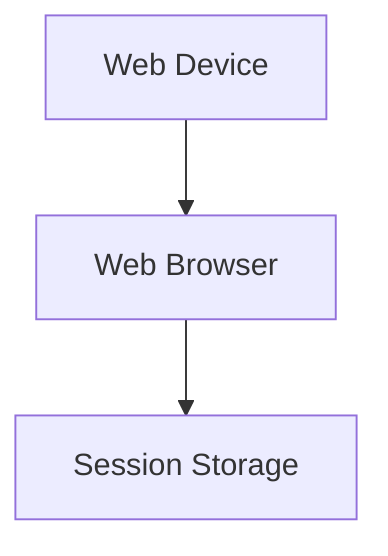

**Threat Model Template:**
- **Threats:**
  - Browser vulnerabilities (XSS, CSRF)
  - Keyloggers/malware
  - Session hijacking
- **Mitigations:**
  - Use CSP, input validation
  - Secure session management
  - Encourage endpoint security
- **Open Questions:**
  - What browsers are officially supported?

---

#### 1.3 Other Device

**Description:**  
Any other device (e.g., kiosk, IoT) used to access the client web app.

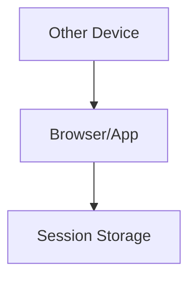

**Threat Model Template:**
- **Threats:**
  - Physical access attacks
  - Untrusted device environment
- **Mitigations:**
  - Limit session duration
  - Require re-authentication
- **Open Questions:**
  - Are there device restrictions for access?

---

### 2. Client Organization

#### 2.1 Client Web App

**Description:**  
The web application delivered to end users, integrating the Sprinklr SDK.

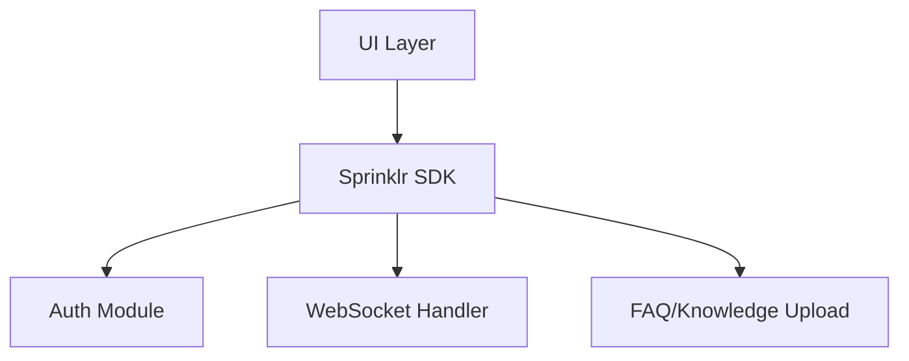

**Threat Model Template:**
- **Threats:**
  - XSS/CSRF
  - Supply chain attacks (malicious SDK)
  - API key leakage
- **Mitigations:**
  - CSP, input/output validation
  - SDK integrity checks
  - Never expose secrets in frontend
- **Open Questions:**
  - How is SDK versioning managed?

---

#### 2.2 Client Admin User

**Description:**  
An admin user from the client organization who configures integration via the Sprinklr Dashboard.

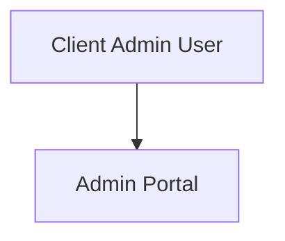

**Threat Model Template:**
- **Threats:**
  - Credential theft
  - Privilege escalation
  - Phishing/social engineering
- **Mitigations:**
  - Enforce MFA
  - Role-based access control
  - Audit admin actions
- **Open Questions:**
  - How are admin accounts provisioned and deprovisioned?

---

### 3. Sprinklr SaaS

#### 3.1 Live Chat Service

**Description:**  
Backend service handling real-time chat sessions.

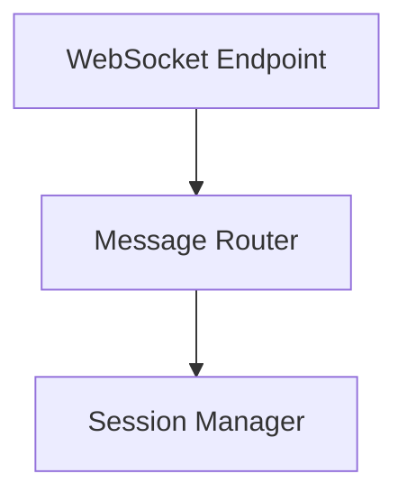

**Threat Model Template:**
- **Threats:**
  - WebSocket hijacking
  - DoS via open connections
  - Cross-tenant data leakage
- **Mitigations:**
  - Enforce TLS
  - Authenticate every session
  - Tenant isolation in routing
- **Open Questions:**
  - What is the max concurrent connection policy?

---

#### 3.2 LLM Context Service

**Description:**  
Service ingesting FAQ/knowledge uploads and providing context to LLM.

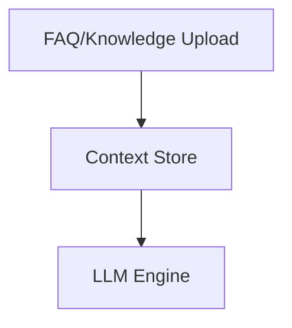

**Threat Model Template:**
- **Threats:**
  - Malicious uploads (prompt injection)
  - Data poisoning
- **Mitigations:**
  - Validate/sanitize uploads
  - Monitor LLM outputs
- **Open Questions:**
  - How is per-tenant context isolation enforced?

---

#### 3.3 Dashboard

**Description:**  
Web interface for onboarding, configuration, and analytics.

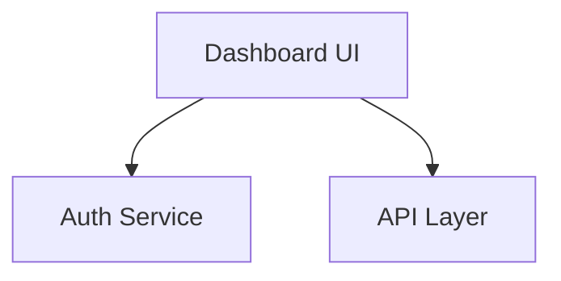

**Threat Model Template:**
- **Threats:**
  - XSS/CSRF in dashboard
  - Unauthorized access
- **Mitigations:**
  - Secure coding practices
  - Strong authentication
- **Open Questions:**
  - Is there SSO support for client admins?

---

#### 3.4 Backend (Integration/Config)

**Description:**  
Backend for authentication, verification, API key/secret issuance, and integration.

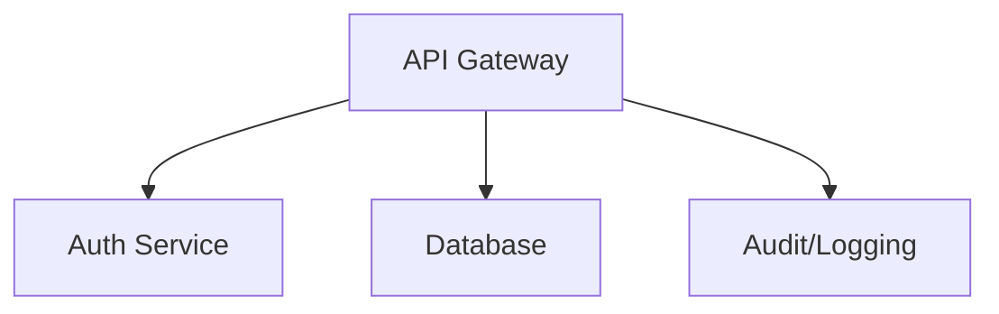

**Threat Model Template:**
- **Threats:**
  - API key leakage
  - Insider threats
- **Mitigations:**
  - Audit logs
  - Key rotation
- **Open Questions:**
  - How are API keys delivered to clients?

---

#### 3.5 Backend (Live Chat)

**Description:**  
Backend for live chat session management and message routing.

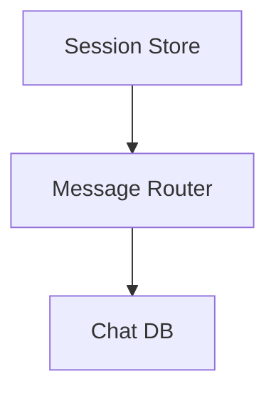

**Threat Model Template:**
- **Threats:**
  - Session hijacking
  - Data leakage between tenants
- **Mitigations:**
  - Per-tenant session isolation
  - Secure session tokens
- **Open Questions:**
  - How is session expiration handled?

---

## 4. S2S LLM Callback to Client Backend

### 4.1 High-Level Diagram

**Description:**  
Shows the flow when the LLM service, upon receiving a user query, makes a server-to-server (S2S) API call to the client backend to fetch personalized data.

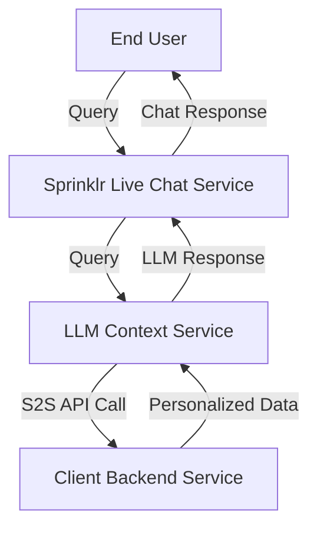

---

### 4.2 LLM Context Service (S2S Callback Component)

**Description:**  
Handles outbound S2S API calls to client backend for personalized data retrieval.

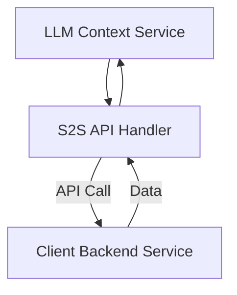

**Threat Model Template:**
- **Threats:**
  - Unauthorized S2S access
  - Data leakage
  - Replay or injection attacks
- **Mitigations:**
  - Mutual TLS or signed tokens
  - Strict data validation
  - Rate limiting and logging
- **Open Questions:**
  - How is S2S authentication managed?

---

### 4.3 Client Backend Service (S2S Endpoint Component)

**Description:**  
Receives S2S API calls from Sprinklr LLM service and returns personalized data.

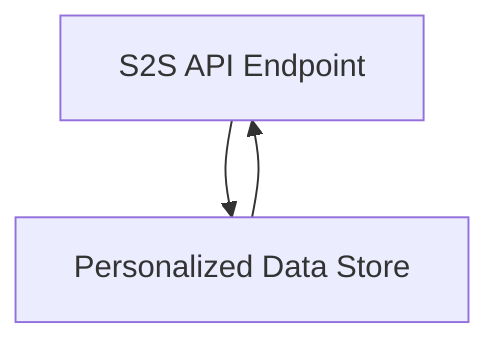

**Threat Model Template:**
- **Threats:**
  - Unauthorized data access
  - Excessive data exposure
  - Abuse of S2S endpoint
- **Mitigations:**
  - Strong authentication/authorization
  - Data minimization
  - Monitoring and alerting
- **Open Questions:**
  - What data is exposed via S2S, and how is access scoped?
