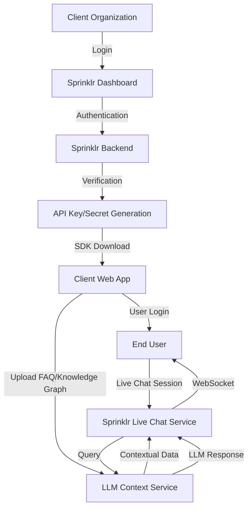
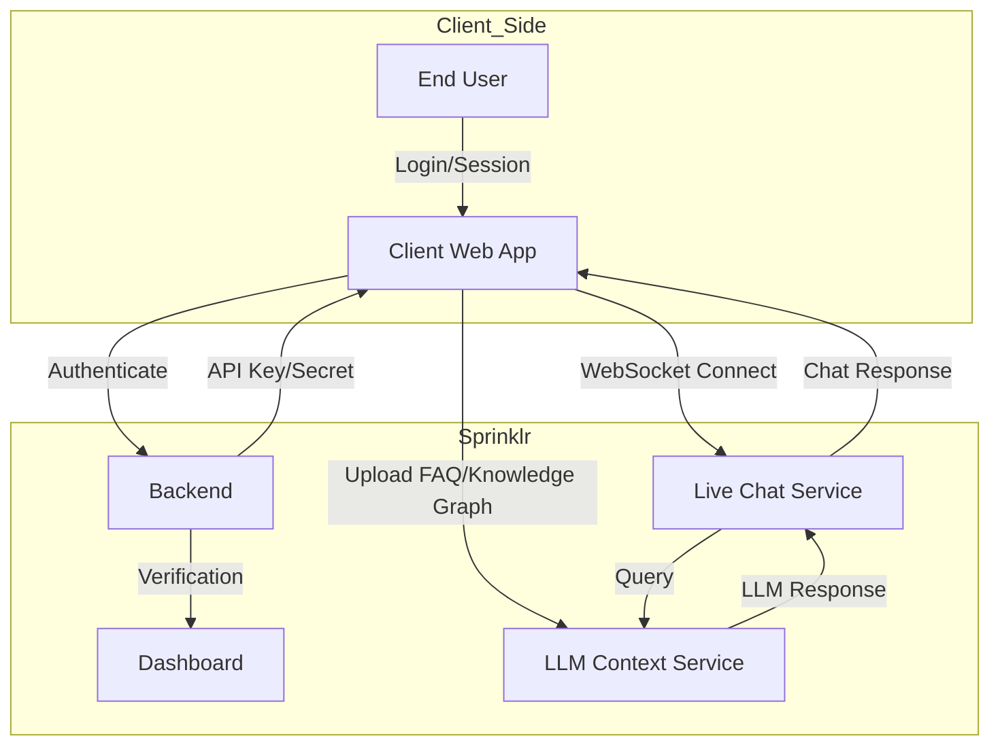
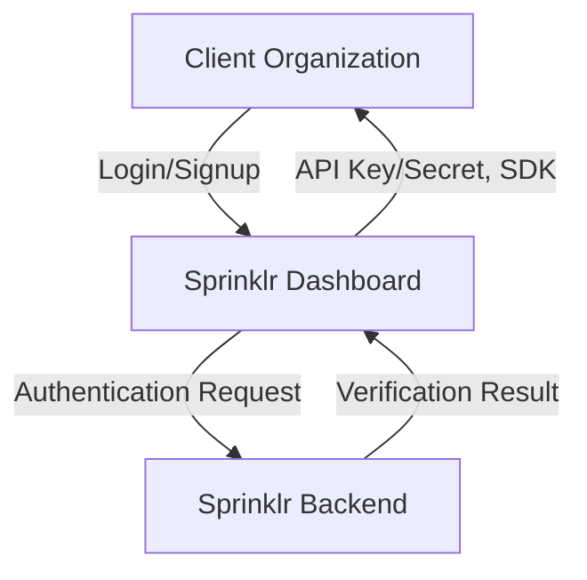
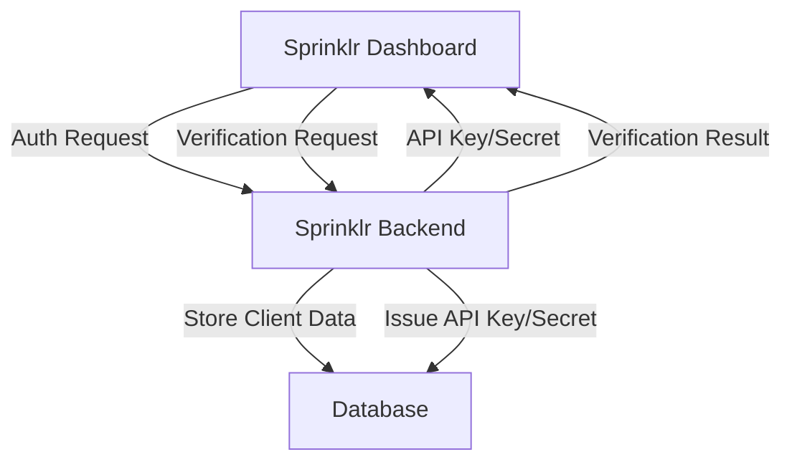
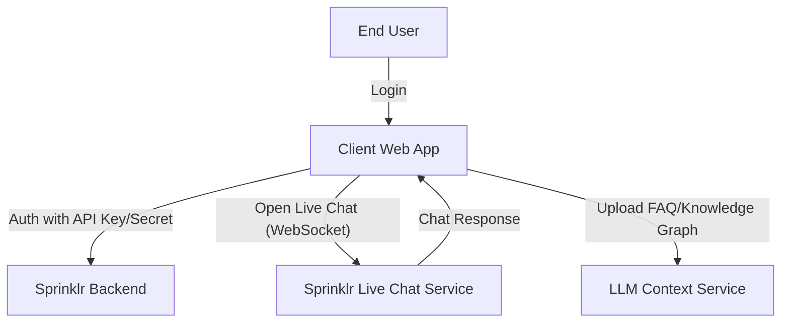
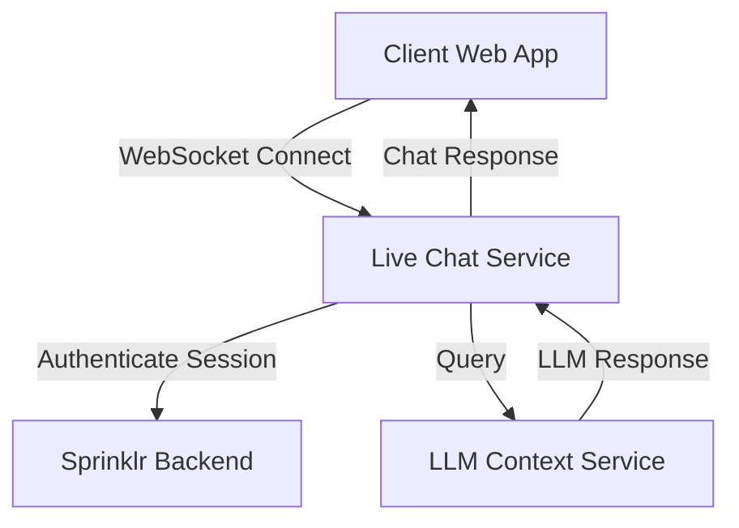
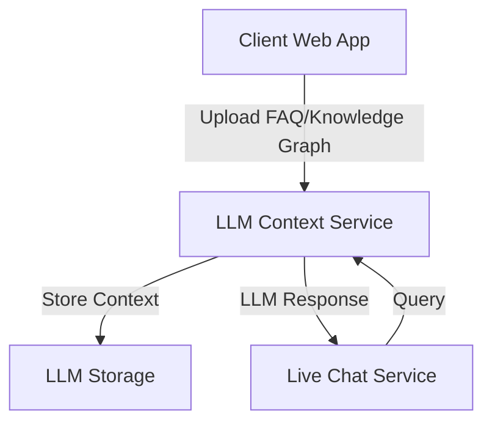
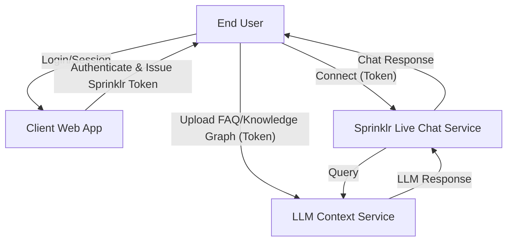
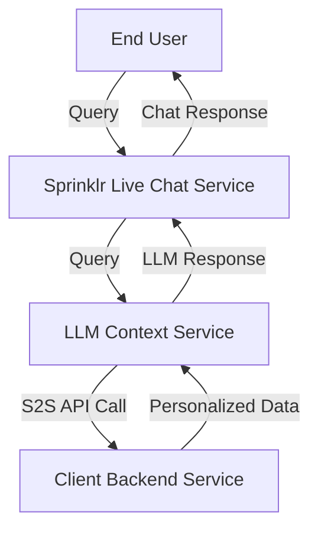

# Sprinklr Live Chat: System Design & Threat Model

## 1. High-Level System Architecture

<!-- Mermaid Diagram: System Architecture -->

**Components:**
- Client Organization: The customer (e.g., HDFC, ICICI) integrating live chat.
- Sprinklr Dashboard: Web interface for client onboarding and management.
- Sprinklr Backend: Handles authentication, verification, API key/secret issuance.
- Client Web App: Where SDK is embedded, used by end-users.
- End User: The customer of the client organization.
- Sprinklr Live Chat Service: Real-time chat backend (WebSocket-based).
- LLM Context Service: Ingests FAQ/knowledge graph, provides context to LLM.

---

## 2. Data Flow Diagram (DFD)

<!-- Mermaid Diagram: Data Flow -->

---

## 3. Threat Model

### A. Authentication & Authorization
- **Threats:**
  - Stolen credentials (client or end-user)
  - Weak API key/secret management
  - Session hijacking
- **Mitigations:**
  - Enforce strong password policies, MFA
  - Secure API key/secret storage (vault, never expose in frontend)
  - Use secure, short-lived tokens for sessions

### B. Data Isolation & Multi-Tenancy
- **Threats:**
  - Data leakage between clients (e.g., HDFC data visible to ICICI)
  - LLM context mixing between tenants
- **Mitigations:**
  - Strict tenant isolation at all layers (DB, LLM context, WebSocket sessions)
  - Per-tenant encryption keys
  - Access control checks on every request

### C. Real-Time Communication (WebSockets)
- **Threats:**
  - Man-in-the-middle attacks
  - WebSocket hijacking
  - DoS via open connections
- **Mitigations:**
  - Enforce TLS for all WebSocket connections
  - Authenticate every WebSocket session
  - Rate limiting and connection quotas

### D. LLM Context Ingestion
- **Threats:**
  - Malicious FAQ/knowledge graph uploads (e.g., prompt injection)
  - Data poisoning
- **Mitigations:**
  - Validate and sanitize all uploads
  - Monitor LLM outputs for anomalies
  - Isolate LLM context per client

### E. Backend Verification & API Key Management
- **Threats:**
  - Insider threats during manual/semi-automated verification
  - API key leakage
- **Mitigations:**
  - Audit logs for all verification actions
  - Rotate API keys regularly
  - Principle of least privilege for backend operators

### F. General Security
- **Threats:**
  - XSS/CSRF in dashboard or client web app
  - Supply chain attacks via SDK
- **Mitigations:**
  - Secure coding practices, regular code audits
  - Content Security Policy (CSP), input validation
  - SDK integrity checks (hash/signature verification)

---

## 4. Component-wise Data Flow Diagrams

### 4.1 Client Organization & Dashboard

<!-- Mermaid Diagram: Client Organization & Dashboard DFD -->

### 4.2 Sprinklr Backend

<!-- Mermaid Diagram: Sprinklr Backend DFD -->

### 4.3 Client Web App & End User

<!-- Mermaid Diagram: Client Web App & End User DFD -->

### 4.4 Sprinklr Live Chat Service

<!-- Mermaid Diagram: Live Chat Service DFD -->

### 4.5 LLM Context Service

<!-- Mermaid Diagram: LLM Context Service DFD -->

---

## 5. Threat Modeling: End User to Client & Sprinklr Communication

### 5.1 Data Flow Diagram (Direct End User ↔ Sprinklr)

<!-- Mermaid Diagram: End User Direct to Sprinklr Communication -->

### 5.2 Threats & Mitigations (Direct Connection)

#### A. End User ↔ Client Web App (Authentication)
- **Threats:**
  - Credential theft (phishing, keylogging)
  - Session hijacking (XSS, CSRF)
  - Data leakage via browser vulnerabilities
- **Mitigations:**
  - Enforce HTTPS, secure cookies, CSP
  - Input validation and output encoding
  - Use secure, short-lived session tokens

#### B. End User ↔ Sprinklr Services (Token-based Direct Connection)
- **Threats:**
  - Token theft or leakage (via XSS, local storage, network)
  - Replay attacks with stolen tokens
  - Insufficient token validation (expired, tampered, wrong audience)
  - Unauthorized access to other tenants' data if token validation is weak
  - Man-in-the-middle attacks if not using TLS
  - DoS via direct connections
- **Mitigations:**
  - Use short-lived, signed tokens (JWT/OAuth2) with strong claims (audience, expiry, client ID)
  - Transmit tokens only over HTTPS/WSS
  - Store tokens securely in browser memory (not localStorage)
  - Validate tokens on every request at Sprinklr (signature, expiry, audience, issuer)
  - Rate limit and monitor direct connections
  - Enforce strict tenant isolation at Sprinklr backend

#### C. End User ↔ LLM Context Service (Direct Upload)
- **Threats:**
  - Malicious uploads (prompt injection, data poisoning)
  - Token replay or misuse for other tenants
- **Mitigations:**
  - Validate and sanitize all uploads
  - Require valid, scoped token for uploads
  - Isolate LLM context per tenant

#### D. Sprinklr Internal (Live Chat ↔ LLM Context)
- **Threats:**
  - Cross-tenant data leakage
  - LLM prompt injection from user input
- **Mitigations:**
  - Strict tenant isolation in LLM context
  - Sanitize all user input before passing to LLM

---

## 6. LLM S2S Callback to Client Backend: Data Flow & Threat Model

### 6.1 Data Flow Diagram

<!-- Mermaid Diagram: LLM S2S Callback to Client Backend -->

### 6.2 Threats & Mitigations

#### A. LLM Service ↔ Client Backend (S2S API Call)
- **Threats:**
  - Unauthorized access to client backend (LLM or Sprinklr backend impersonation)
  - Data leakage of sensitive/personalized information
  - Insufficient authentication or weak API keys/tokens
  - Replay attacks or request tampering
  - Excessive or abusive data requests (DoS, scraping)
  - Injection attacks (malicious queries from LLM to client backend)
  - Lack of audit/logging for S2S calls
- **Mitigations:**
  - Use strong mutual authentication (mTLS, signed JWTs, or OAuth2) for S2S calls
  - Enforce strict authorization and data minimization on client backend
  - Validate and sanitize all requests and responses
  - Implement rate limiting and monitoring on S2S endpoints
  - Log all S2S requests and responses for audit and anomaly detection
  - Encrypt all S2S traffic (TLS)
  - Ensure least privilege: LLM can only access endpoints/data required for the query
  - Monitor for unusual access patterns or data exfiltration attempts

#### B. LLM ↔ End User (Personalized Data Disclosure)
- **Threats:**
  - LLM leaking more data than intended in its response
  - Prompt injection causing LLM to exfiltrate sensitive data
- **Mitigations:**
  - Post-process and filter LLM outputs for sensitive data
  - Strictly scope S2S data returned to LLM
  - Monitor LLM responses for data leakage

---

## 7. Next Steps

- Deep dive into each component for detailed threat enumeration and mitigations.
- Review architecture for compliance with security best practices.
