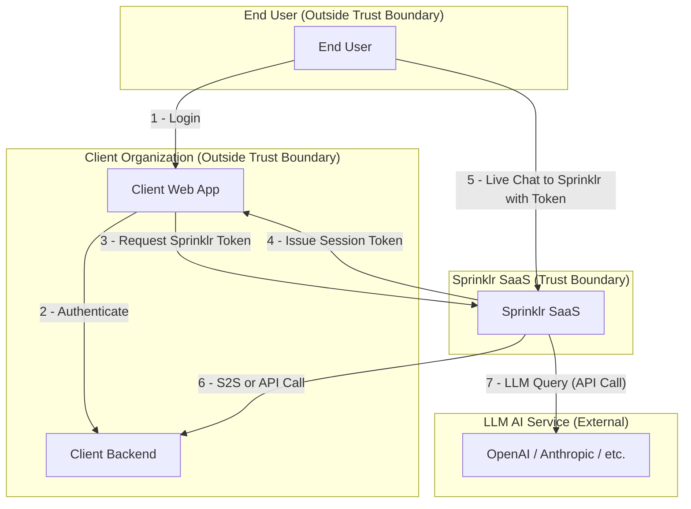
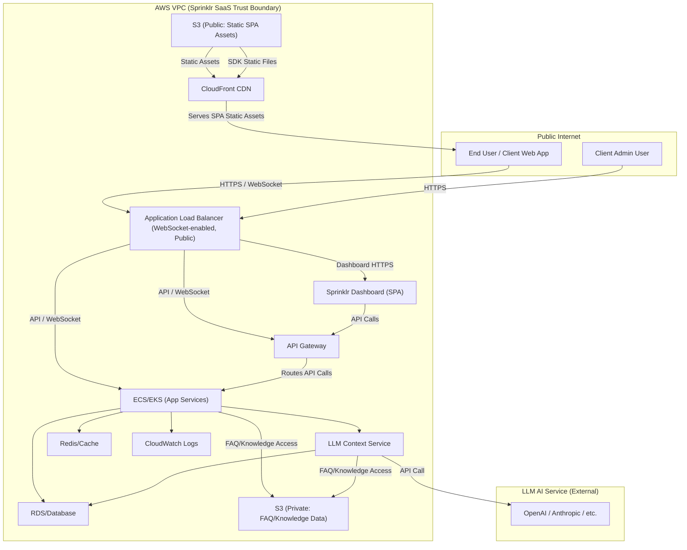
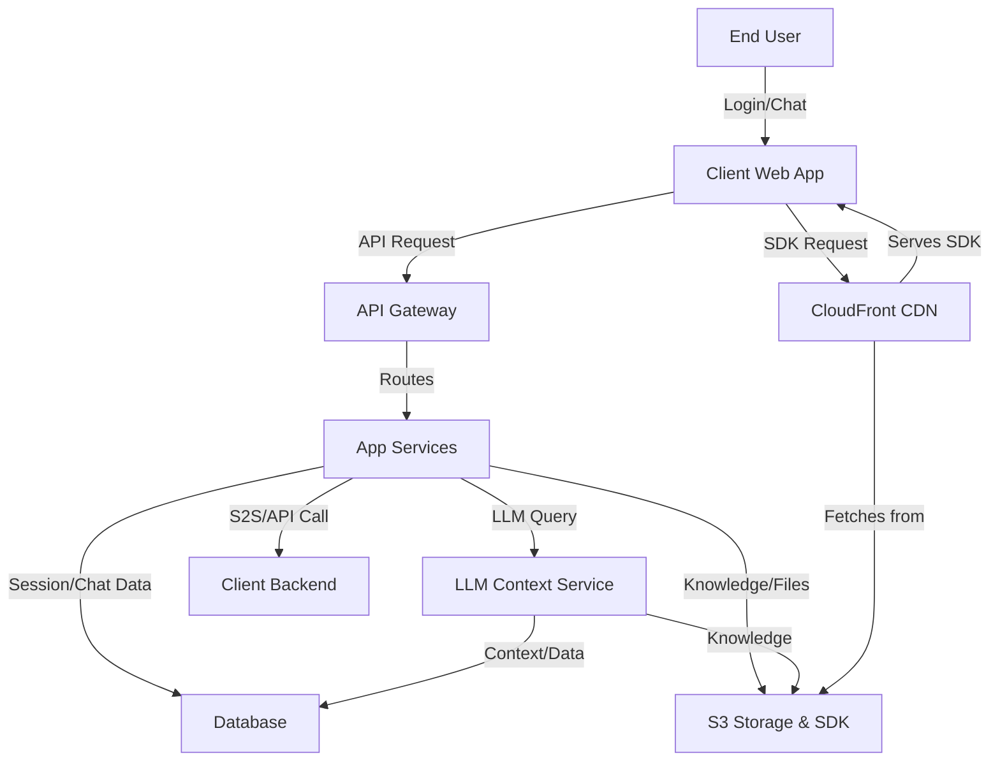

# Architecture: Sprinklr Live Chat

## 1. High-Level System Architecture

This section provides a top-level overview of the main trust boundaries and data flows in the Sprinklr Live Chat system. It illustrates how the End User interacts with the Client Web App, how authentication and session tokens are managed, and how the Client Web App and End User communicate with the Sprinklr SaaS platform for live chat functionality. The diagram highlights the separation between client and Sprinklr trust boundaries and the key steps in the authentication and chat flow.

---

## 2. Sprinklr SaaS Cloud Architecture & Data Flows

This section details the internal cloud architecture of the Sprinklr SaaS platform as deployed on AWS, and the major data flows between its components. These diagrams help identify cloud-specific attack surfaces, trust boundaries, and the secure delivery path for the SDK.

### 2.1 High-Level AWS System Architecture

The following diagram shows the main AWS infrastructure components used by Sprinklr SaaS, including load balancers, API gateways, compute clusters, storage, caching, logging, and the use of S3 and CloudFront for secure SDK delivery. WebSocket connections for live chat are supported via the Application Load Balancer (ALB) and routed to the ECS/EKS app services. This view is essential for understanding network segmentation, service isolation, and the entry points for both API and static asset requests.

---

### 2.2 Data Flow Diagram (DFD)

This diagram illustrates the flow of data between the main actors and services in the Sprinklr SaaS platform, including user authentication, chat session management, LLM context queries, S2S/API calls, and the secure delivery of the SDK via CloudFront and S3. It highlights the key integration points and the movement of sensitive data across trust boundaries.

---

## 3. Data Flow Diagrams

(See attached diagrams for each group and component)

---

## Summary

This architecture document provides a detailed view of the Sprinklr Live Chat platform's cloud infrastructure, data flows, and integration points. It is intended to support further analysis in threat modeling and secure architecture.
