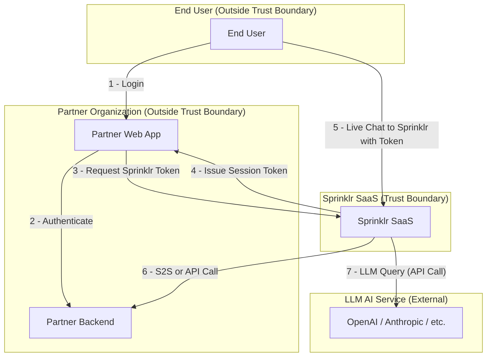

# System Design: Sprinklr Live Chat

## Project Overview

**Sprinklr Live Chat** is a centralized SaaS platform designed to enable organizations to integrate real-time chat functionality into their web and mobile applications. The platform provides a secure, scalable, and context-aware chat experience, leveraging large language models (LLMs) for intelligent responses and knowledge integration.

## Document Scope

This document presents the system design for the **Sprinklr Live Chat** system, focusing on the high-level structure, main actors, and data flows.

**Assumptions:**  
- **Sprinklr SaaS** (including all Sprinklr-operated services and infrastructure) is considered **within our trust boundary**.
- All other entities—including **end users**, **client organizations**, **client web apps**, and **client backends** —are considered **outside the trust boundary**.
- The threat model assumes a zero-trust approach for all interactions crossing into Sprinklr from external users, systems, or services.
- The analysis is based on the current system architecture and may require updates as the platform evolves. 

**Note:** For the scope of simplicity, this document focuses on the web service, SDK, and mobile SDK. Other services are considered out of scope for this system design.

---

## Definitions

### 1. Partner Organization

An organization (e.g., a bank, retailer) that integrates Sprinklr Live Chat into its own web or mobile applications for its customers. Ex: HDFC Bank, ICICI Bank, etc.

#### 1.1 Partner Web App

The webapp owned by the partner organization, into which the Sprinklr SDK is embedded.

#### 1.2 Partner Admin User

A user(s) from the partner organization responsible for configuring, managing, and monitoring the Sprinklr integration in their web-app via the Sprinklr Dashboard, upload or update knowledge graph, FAQs, etc.

#### 1.3 Partner Backend

An API server hosted by the partner organization, exclusively accessible by Sprinklr systems. It provides dynamic user data, session context, and personalized knowledge. It may also include the MCP server used by Sprinklr LLM Agentic flows to provide personalized response to end-user.

#### 1.4 Partner's MCP Server

A direct API call from Sprinklr’s LLM Context Service to the partner’s backend to retrieve personalized data for an end user query.

### 2. End User

An **End User** is an authorized individual associated with a partner organization who interacts with the partner’s web or mobile application. This user is typically a customer, user, or internal user of the partner, and has the necessary entitlements to initiate and participate in live chat conversations via the embedded SprinklrSDK.

### 3. Sprinklr SaaS

Sprinklr is a centralized cloud platform offering a comprehensive suite of services, including realtime live chat, LLM-powered intelligence, dashboards for partners to manage integration, etc. This platform unifies all unique services within our trusted system, delivering a cohesive and secure SaaS experience.

---

## High-Level System Overview

**Sprinklr Live Chat** is a SaaS platform enabling organizations to integrate real-time chat into their web and mobile applications. The system is designed with strong isolation between *end users*, *partner organizations*, and *Sprinklr SaaS*, and leverages LLMs (local models or external API based services) for contextual responses.

---

## High-Level Data Flow Diagram

---

## Component Definitions

- **Sprinklr Live Chat Auth Service:** Manages real-time chat sessions, authenticates and authorizes end-users and clients, and creates secure websocket channels.
- **Sprinklr LLM Context Service:** Ingests FAQs and knowledge uploads, provides context to the LLM, and may call back to partner backends for personalized data.
- **Sprinklr Dashboard:** Web interface for partner admin users to onboard, configure, and monitor their Sprinklr integration.
- **Sprinklr Integration Backend:** Backend service for authentication, verification, API key/secret issuance, and integration management.

---

<!--
## Trust Boundaries

A **trust boundary** is any point where data or control flows across systems or users with differing levels of trust or administrative control. Each boundary introduces potential risks and must be analyzed for controls and mitigations.

---

For details on trust boundaries and security analysis, see [threat_model.md](./threat_model.md).
-->

## Summary

This system design document provides a high-level overview of the Sprinklr Live Chat platform, its main actors, and the data flows between them. The next sections (in separate files) will cover detailed architecture, threat modeling, and secure architecture practices.

---

## Appendix: Including and Referencing Attachments

To provide comprehensive documentation for system design, threat modeling, and secure architecture review (covering both application and cloud aspects), follow these guidelines for including and referencing attachments:

### 1. File Formats and Organization

- Use standard formats: PDF, PNG, SVG, Markdown (.md), or editable diagrams (e.g., draw.io, Lucidchart).
- Store attachments in a dedicated directory (e.g., `attachments/` or `diagrams/`).
- Use clear, descriptive filenames (e.g., `system_architecture_cloud.png`, `threat_model_app.pdf`).

### 2. Referencing Attachments in Documentation

- Reference attachments inline using Markdown:
  - For images/diagrams:  
    ``
  - For documents:  
    `[Threat Model Details](./attachments/threat_model_app.pdf)`
- For large or external files, provide a link to the location (e.g., shared drive, Confluence, or Git repository).

### 3. Application vs. Cloud Focus

- Clearly label each attachment as "Application" or "Cloud" focused in its filename or in the documentation.
- Example:  
  - `system_design_app.md` (application-level design)  
  - `system_design_cloud.md` (cloud infrastructure design)

### 4. Example References

- **System Design Diagram (Cloud):**  
  ``
- **Threat Model Table (Application):**  
  `[Threat Model Table](./attachments/threat_model_app.pdf)`
- **Secure Architecture Review (Cloud):**  
  `[Secure Architecture Review](./attachments/secure_arch_cloud.pdf)`

### 5. Best Practices

- Keep attachments up to date with the main documentation.
- Version control all attachments where possible.
- Cross-reference attachments in relevant sections for clarity.

---

This appendix ensures that all supporting materials for system design, threat modeling, and secure architecture are easy to locate, reference, and maintain.
