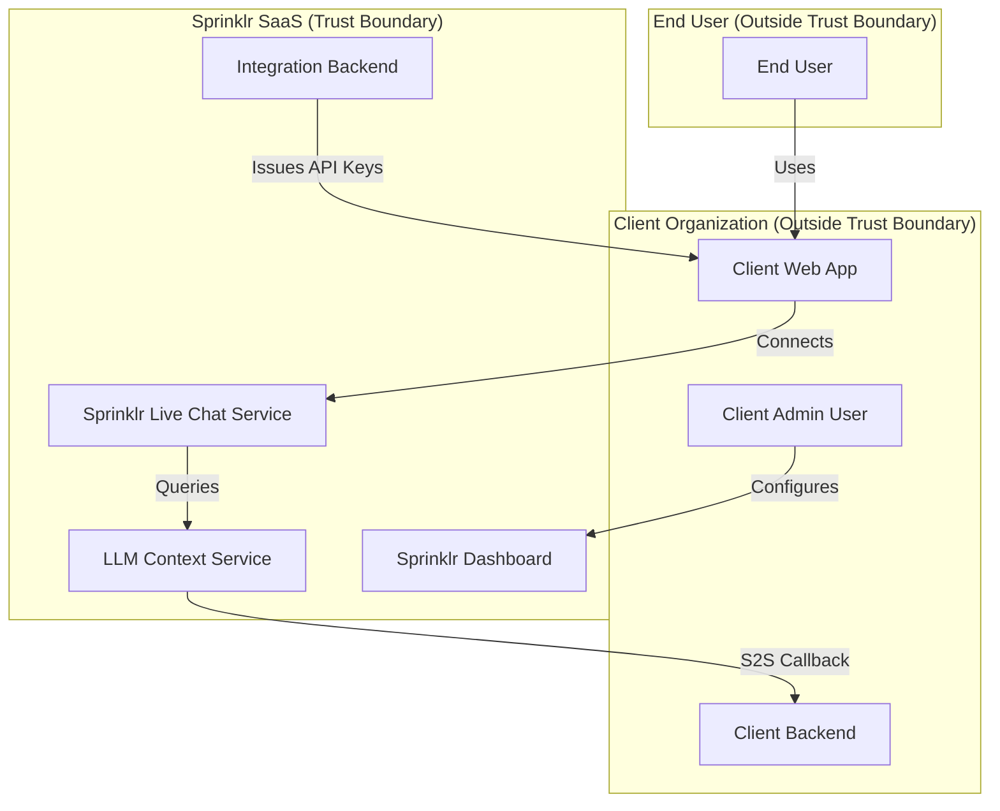
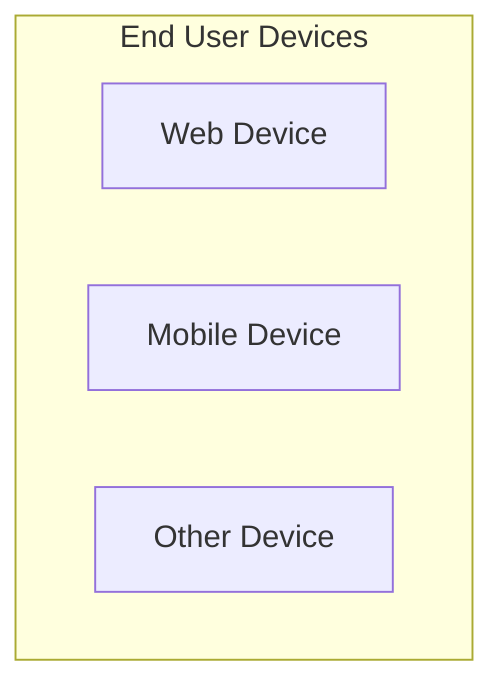
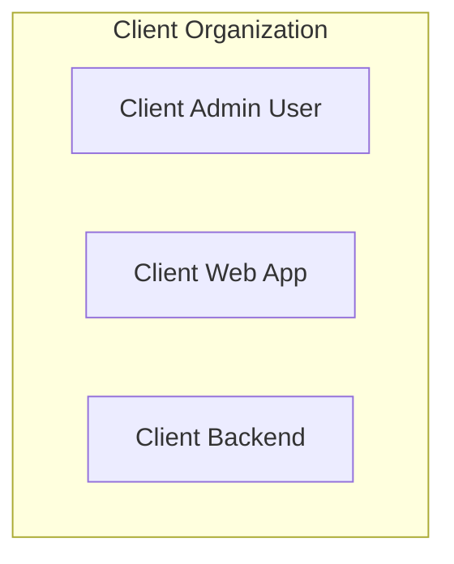
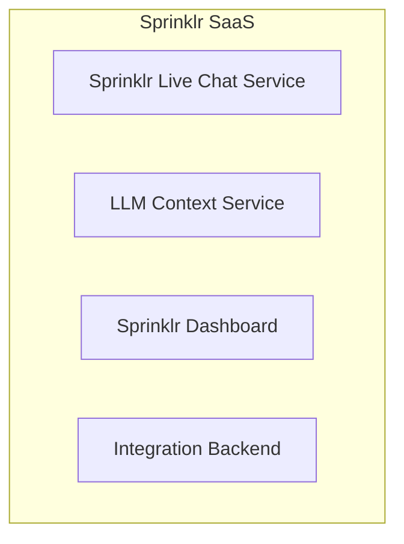
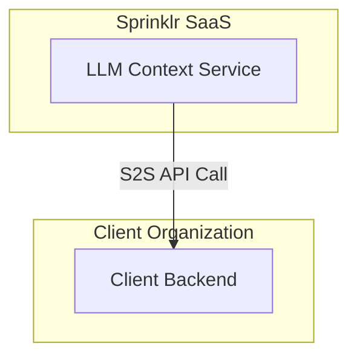
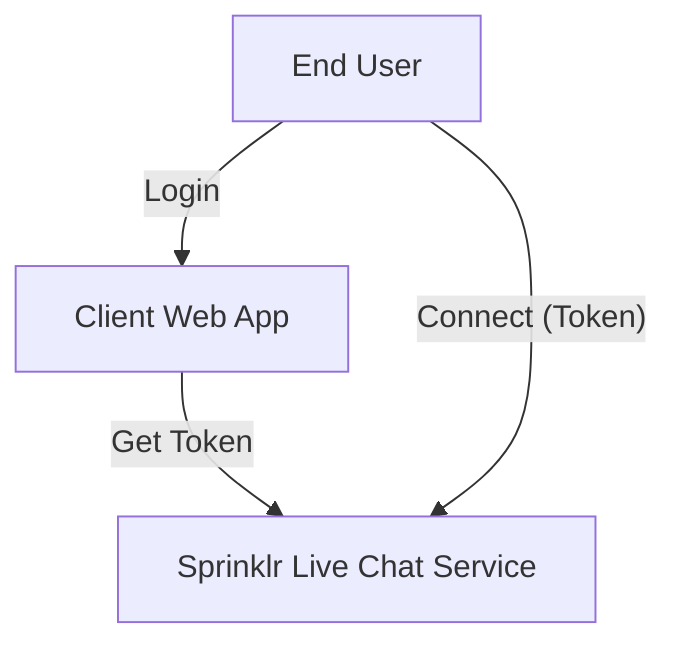
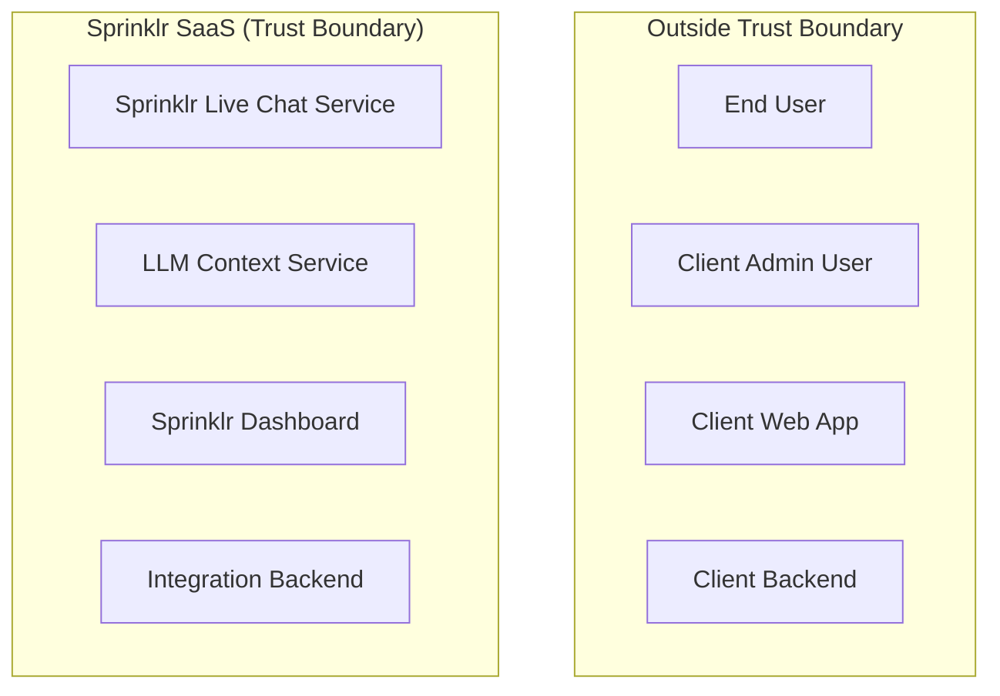

# Threat Modeling: Group & Component Diagrams

This document provides Mermaid diagrams for each major group and component defined in the threat modeling report, visually clarifying trust boundaries and relationships.

---

## 1. High-Level Trust Boundaries

---

## 2. End User Devices

---

## 3. Client Organization

---

## 4. Sprinklr SaaS

---

## 5. S2S LLM Callback Flow

---

## 6. Session Token Flow

---

## 7. Trust Boundary Overview

---

Each diagram above corresponds to a key group or component from the Definitions section, visually clarifying boundaries and relationships for threat modeling.
