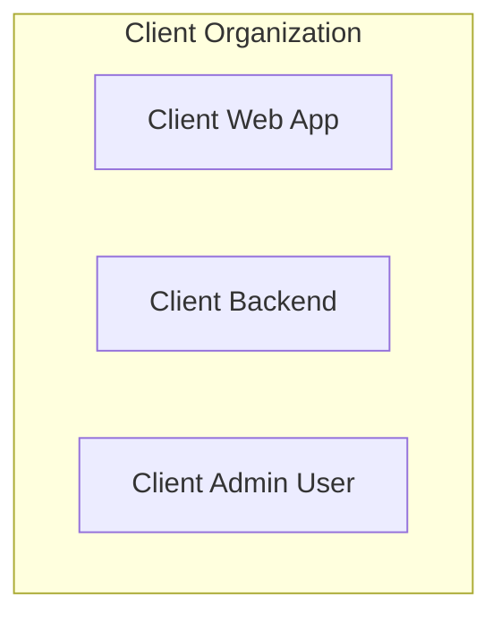
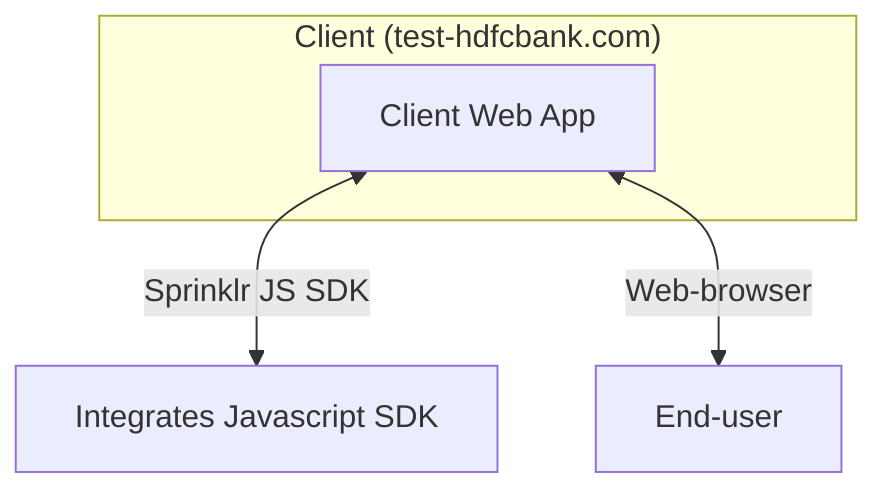
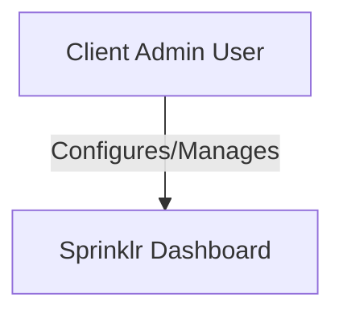
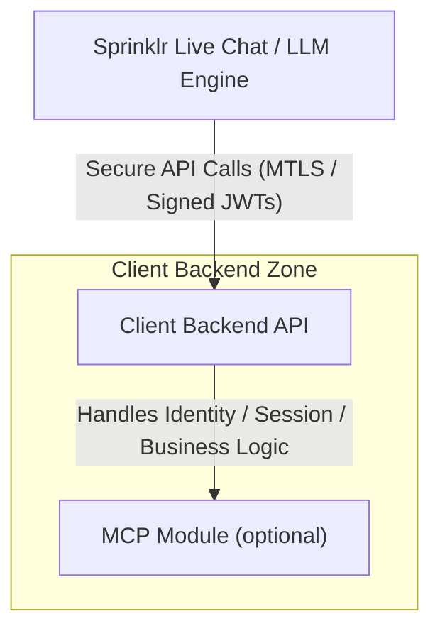
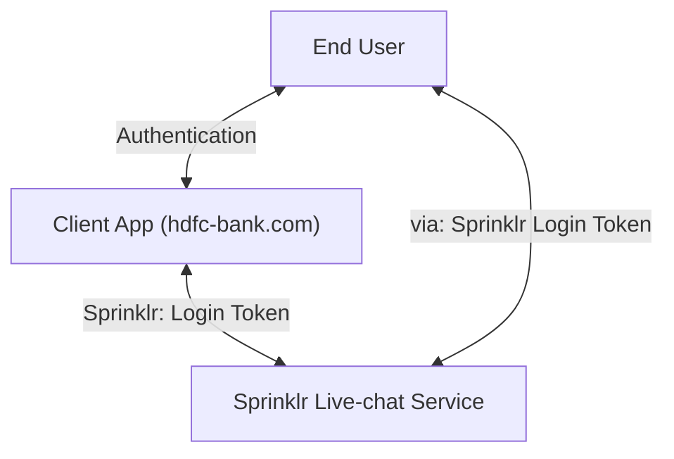
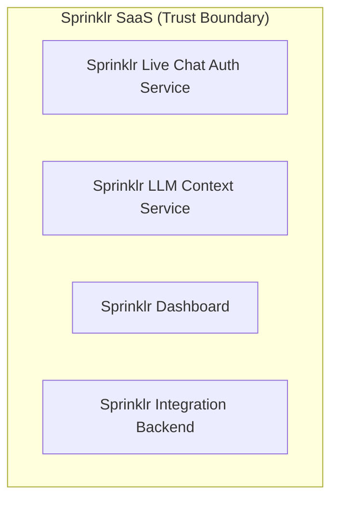
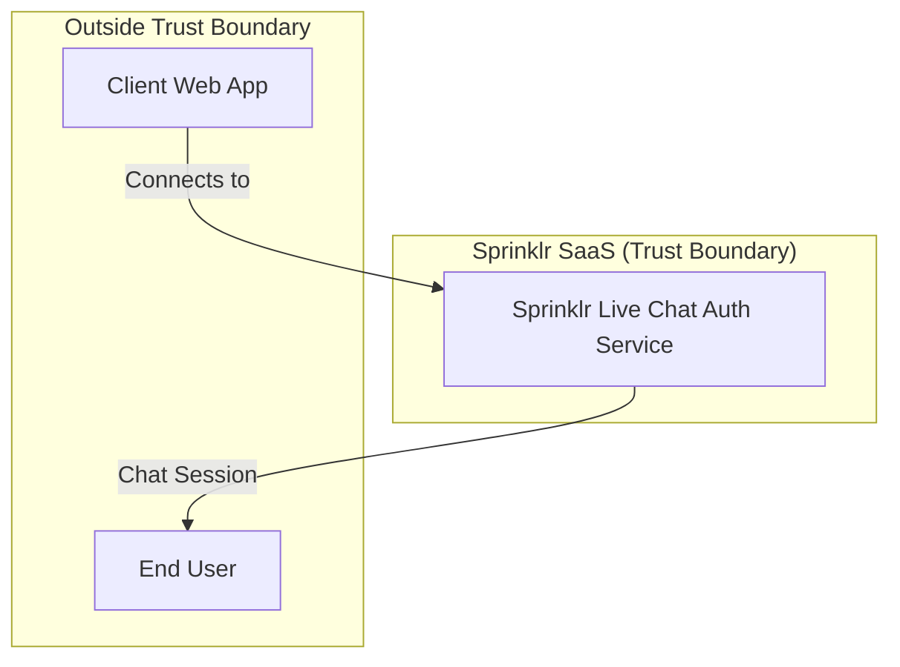
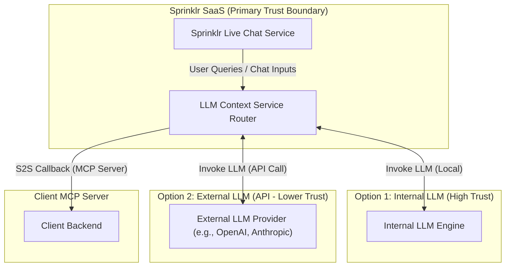
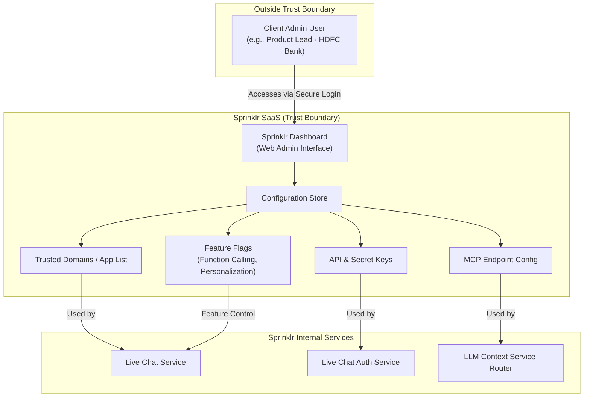
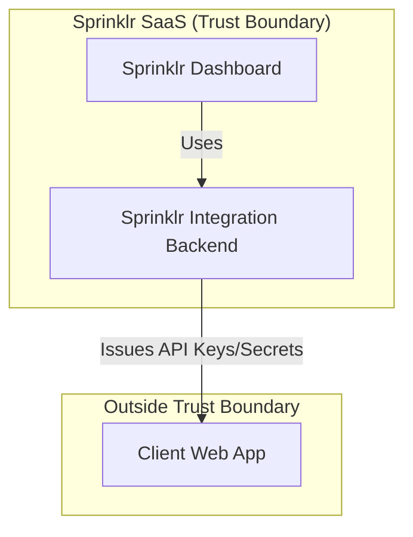

# Thread Modeling Report

## Sprinklr Live Chat

---

# Project Details:
**"Sprinklr Live Chat"** is a centralized SaaS platform designed to enable organizations to integrate real-time chat functionality into their web and mobile applications. The platform provides a secure, scalable, and context-aware chat experience, leveraging large language models (LLMs) for intelligent responses and knowledge integration.

# Activity
This document presents a comprehensive threat modeling exercise for the **Sprinklr Live Chat** system. The goal is to systematically identify, analyze, and mitigate security threats across all major components and data flows. The report includes high-level and component-level diagrams, threat analysis, mitigations, and open questions to guide ongoing security improvements.

**Assumptions:**  
- **Sprinklr SaaS** (including all Sprinklr-operated services and infrastructure) is considered **within our trust boundary**.
- All other entities—including **end users**, **client organizations**, **client web apps**, and **client backends** —are considered **outside the trust boundary**.
- The threat model assumes a zero-trust approach for all interactions crossing into Sprinklr from external users, systems, or services.
- The analysis is based on the current system architecture and may require updates as the platform evolves. 

**Note:** For the scope of simplicity, we will restrict our focus on web service and SDK, and mobile SDK . services would be considered out of scope for this activity.

---

# Overview

**Sprinklr Live Chat** is a SaaS platform enabling organizations to integrate real-time chat into their web and mobile applications. 

The system is designed with strong isolation between *end users**, *client organizations***, and *Sprinklr SaaS****, and leverages LLMs (local models or external API based services) for contextual responses. 

---

# Definitions

## 1. Client Organization
An organization (e.g., a bank, retailer) that integrates Sprinklr Live Chat into its own web or mobile applications for its customers. Ex: HDFC Bank, ICICI Bank, etc.

**1.1 Client Web App:**   
The webapp owned by the client organization, into which the Sprinklr SDK is embedded.

**1.2 Client Admin User:**  
A user(s) from the client organization responsible for configuring, managing, and monitoring the Sprinklr integration in their web-app via the Sprinklr Dashboard, upload or update knwoldge graph, FAQs, etc. 

**1.3 Client Backend**
An API server hosted by the client organization, exclusively accessible by Sprinklr systems. It provides dynamic user data, session context, and personalized knowledge. It may also include the MCP  server used by Sprinklr LLM Agentic flows to provided personalized response to end-user.

**1.4 Client's MCP Server:**  (extended & optional component from **1.3**)
A direct API call from Sprinklr’s LLM Context Service to the client’s backend to retrieve personalized data for an end user query.
The server callback may act to retrive personalized data of the enduser via MCP protocol (if-supported)

## 2. End User

An **End User** is an authorized individual associated with a client organization who interacts with the client’s web or mobile application. This user is typically a customer, partner, or internal user of the client, and has the necessary entitlements to initiate and participate in live chat conversations via the embedded SprinklrSDK.

## 3. Sprinklr SaaS:
Sprinklr is a centralized cloud platform offering a comprehensive suite of services, including realtime live chat, LLM-powered intelligence, dashboards for clients to manage integration, etc.. 

This platform unifies all unique services within our trusted system, delivering a cohesive and secure SaaS experience.

**3.1 Sprinklr Live Chat Auth Service:**   
The backend service within Sprinklr SaaS that manages real-time chat sessions between end users and the system.
The service will be responsible to authenticate, and authorize end-user, and the associated client, and create a secure websocket channel.

**3.2 Sprinklr LLM Context Service:**   ( Internal Service: Within the trust boundary )
A service that ingests FAQs and knowledge uploads from clients, provides context to the LLM, and may call back to client backends for personalized data of the end-user.

The messages received from end-user, are processed and a response is generated & is sent back to the end-user.

The service also exposes LLM agent calls that needs to be supported & implemented via client through a valid MCP protocol. If configured, the servie can execute function çalls to client's NCP server, and can further process and respond back to client via live-chat session. 

**3.3 Sprinklr Dashboard:**  
A web interface for client's admin account (Ex: Product Lead from hdfcbank , who would be responsible to integragte & manage sprinklr SDK with the webapp) to onboard, configure, and monitor their Sprinklr integration.

This dashboard provides following features:

1. Whitelist the trusted list of domains and apps, where they would want to integrate Live Chat SDK.

2. The dashboard also provides provosion to configure their  MCP server endpoints, enable / disable personalized queries & function calling.

3. Reset API & Secret Keys.

**3.4 Sprinklr Integration Backend:**  
Sprinklr’s backend service for authentication, verification, API key/secret issuance, and integration management.

## 🔐 Trust Boundaries – Preface & Definitions

**Trust Boundary:**  

This section defines all trust boundaries identified within the architecture. 

A **trust boundary** is any point where data or control flows across systems or users with differing levels of trust or administrative control. Each boundary introduces potential risks and must be analyzed for controls and mitigations.

Each entry includes:

- **id**: Unique identifier
- **description**: Purpose and flow across the boundary
- **source zone**: Origin of data/control
- **target zone**: Destination of data/control
- **type**: `External`, `Internal`, `Partner`, or `Semi-Trusted`
- **security implications**: Key risks and required controls

---

### 🔸 TB-01: End User → Live Chat (Sprinklr)
- **id**: TB-01  
- **description**: End users interact with Sprinklr’s live chat via frontend web or mobile SDKs.  
- **source zone**: End User (Untrusted / Internet)  
- **target zone**: Sprinklr Live Chat (SaaS)  
- **type**: External  
- **security implications**:
  - MITM Attacks
  - Identity spoofing via JWT/session tokens  
  - Unvalidated message injection (XSS/DoS)  
  - Requires input validation, rate limiting, and session hardening  

---

### 🔸 TB-02: Client Admin → Sprinklr Dashboard
- **id**: TB-02  
- **description**: Admin users log into Sprinklr to configure workflows, analytics, and responses.  
- **source zone**: Client Admin (Privileged User)  
- **target zone**: Sprinklr Admin UI (SaaS)  
- **type**: External  
- **security implications**:
  - Session hijacking or phishing  
  - Configuration drift or overprivilege  
  - Enforce MFA, logging, and role-based access  
  - Prompt Injection

---

### 🔸 TB-03: Sprinklr LLM → Client API / MCP Server
- **id**: TB-03  
- **description**: LLM makes runtime callbacks to client’s backend for memory/context enrichment.  
- **source zone**: Sprinklr LLM Engine  
- **target zone**: Client MCP API  
- **type**: Partner  
- **security implications**:
  - Request spoofing or replay  
  - Data leakage or poisoning  
  - Requires signed callbacks, MTLS, IP allowlist  

---

### 🔸 TB-04: LLM → External Plugin / Tooling
- **id**: TB-04  
- **description**: LLM invokes 3rd-party or customer-approved plugins via APIs for enriched actions.  
- **source zone**: LLM Plugin System  
- **target zone**: Plugin Tooling (e.g., 3rd-party SaaS , OpenAI, Azure, ... )  
- **type**: Semi-Trusted / External  
- **security implications**:
  - Insecure plugin code execution  
  - Data sent to external sources  
  - Vet plugins, apply scopes, and sandbox executions  

---

### 🔸 TB-05: Sprinklr Admin ↔ LLM Prompt Config
- **id**: TB-05  
- **description**: Admins create prompt templates/rules that influence LLM behavior.  
- **source zone**: Sprinklr Admin  
- **target zone**: Prompt Repository  
- **type**: Internal  
- **security implications**:
  - Prompt injection through misconfiguration  
  - Admin abuse or errors  
  - Input validation and version-controlled changes  

---

### 🔸 TB-06: Sprinklr Infra ↔ LLM Subsystem
- **id**: TB-06  
- **description**: Sprinklr internal services invoke the LLM as part of chat or workflow orchestration.  
- **source zone**: Internal Services (e.g., Orchestration Layer)  
- **target zone**: LLM Runtime  
- **type**: Internal  
- **security implications**:
  - Misuse of LLM APIs  
  - Token leakage between systems  
  - Use service identity, token scopes, and logging  

---

### 🔸 TB-07: Trust Boundary Within the System
- **id**: TB-07  
- **description**: Even within Sprinklr’s internal zones, differing trust levels exist (e.g., between stateless orchestration and memory storage, or agent vs. data plane).  
- **source zone**: Higher-privileged Sprinklr Component  
- **target zone**: Lower-privileged Internal Service  
- **type**: Internal (Isolated Trust Domain)  
- **security implications**:
  - Insider lateral movement  
  - Escalation via service misconfig  
  - Enforce inter-service ACLs and mutual auth  

---

---

# Detailed Report

## 1. High-Level System Architecture

(See attached diagram: High-Level Trust Boundaries & Data Flows)

## 2. Component-Level Analysis

### 2.1 End User Devices
- **Threats:** Device compromise, session hijacking, phishing
- **Mitigations:** Secure tokens, HTTPS, user education

### 2.2 Client Web App
- **Threats:** XSS/CSRF, supply chain (SDK), API key leakage
- **Mitigations:** CSP, input validation, SDK integrity checks

### 2.3 Client Admin Users
- **Threats:** Credential theft, privilege escalation
- **Mitigations:** MFA, RBAC, audit logs

### 2.4 Sprinklr Live Chat Service
- **Threats:** WebSocket hijacking, DoS, cross-tenant leakage
- **Mitigations:** TLS, session authentication, tenant isolation

### 2.5 LLM Context Service
- **Threats:** Malicious uploads, data poisoning
- **Mitigations:** Upload validation, LLM output monitoring

### 2.6 Sprinklr Dashboard & Integration Backend
- **Threats:** XSS/CSRF, API key leakage, insider threats
- **Mitigations:** Secure coding, strong auth, audit logs

### 2.7 S2S LLM Callback to Client Backend
- **Threats:** Unauthorized S2S access, data leakage, replay/injection
- **Mitigations:** Mutual TLS, strict validation, rate limiting

---

## 3. Data Flow Diagrams

(See attached diagrams for each group and component)

---

## 4. Threat Model Summary

- **Authentication & Authorization:** Strong tokens, MFA, RBAC
- **Data Isolation:** Per-tenant isolation at all layers
- **Real-Time Communication:** TLS, session validation, quotas
- **LLM Context & S2S:** Input validation, least privilege, monitoring
- **Incident Response:** Logging, anomaly detection, key rotation

---

## 5. Open Questions & Gaps

- Third-party integrations, mobile-specific threats, incident response process
- Key management, privacy compliance, LLM abuse controls
- S2S endpoint scoping and authentication

---

_This report should be reviewed and updated as the system evolves and new features or integrations are added._
